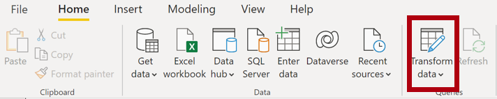
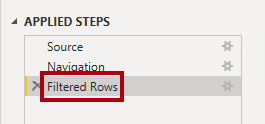
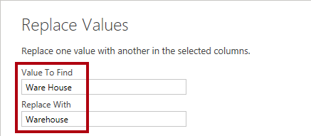
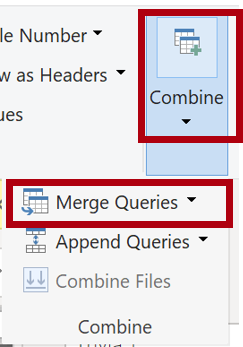

---
lab:
    title: 'Load Transformed Data in Power BI Desktop'
    module: 'Clean, Transform, and Load Data in Power BI'
---

# Load Transformed Data in Power BI Desktop

## **Lab story**

Trong phòng thí nghiệm này, bạn sẽ sử dụng các kỹ thuật chuyển đổi và làm sạch dữ liệu để bắt đầu định hình mô hình dữ liệu của mình. Sau đó, bạn sẽ áp dụng các truy vấn để tải từng truy vấn dưới dạng bảng vào mô hình dữ liệu.

Trong phòng thí nghiệm này, bạn học cách:

- Áp dụng các biến đổi khác nhau
- Tải truy vấn vào mô hình dữ liệu

**Phòng thí nghiệm này sẽ mất khoảng 45 phút.**

## **Get started**

Trong nhiệm vụ này, bạn sẽ thiết lập môi trường cho phòng thí nghiệm.

*Quan trọng: Nếu bạn đã hoàn thành bài thực hành trước đó trong cùng một máy ảo, hãy chuyển sang nhiệm vụ tiếp theo.*

1. Mở Power BI Desktop.

	*Mẹo: Theo mặc định, hộp thoại Bắt đầu sẽ mở ra trước Power BI Desktop. Bạn có thể chọn đăng nhập rồi đóng cửa sổ bật lên.*

    

1. Trong Power BI Desktop chọn file theo đường dẫn sau **File > Open Report > Browse Reports**.

1. Trong cửa sổ **Open**, điều hướng đến thư mục **D:\PL300\Labs\02-load-data-with-power-query-in-power-bi-desktop\Starter** và mở  **Sales Analysis** tập tin.

1. Đóng mọi cửa sổ thông tin có thể mở.

1. Lưu ý thông báo cảnh báo màu vàng bên dưới dải băng.

	*Thông báo này thông báo cho bạn biết rằng các truy vấn chưa được áp dụng để tải dưới dạng bảng mô hình. Bạn sẽ áp dụng các truy vấn sau trong phòng thí nghiệm này.*

	Để loại bỏ thông báo cảnh báo, ở bên phải thông báo cảnh báo màu vàng, hãy chọn **X**.

1. Để tạo một bản sao của tệp, hãy chuyển đến **Tệp > Lưu dưới dạng** và lưu vào thư mục **D:\PL300\MySolution**.

1. Nếu được nhắc áp dụng các thay đổi, hãy chọn **Apply Later**.

## **Configure the Salesperson query**

Trong nhiệm vụ này, bạn sẽ sử dụng Power Query Editor để định cấu hình truy vấn **Salesperson**.

*Quan trọng: Khi được hướng dẫn đổi tên cột, điều quan trọng là bạn phải đổi tên cột chính xác như được mô tả.*

1. Để mở cửa sổ **Power Query Editor**, trên tab dải băng **Home**, từ bên trong nhóm **Queries**, hãy chọn biểu tượng **Transform Data**.

     

1. Trong cửa sổ **Power Query Editor**, trong ngăn **Queries**, hãy chọn truy vấn **DimEmployee**.

     

1. Để đổi tên truy vấn, trong ngăn **Query Settings** (nằm ở bên phải), trong hộp **Name**, hãy thay thế văn bản bằng **Salesperson**, sau đó nhấn **Enter**. Sau đó xác minh rằng tên đã được cập nhật trong ngăn **Queries**.

	* Tên truy vấn xác định tên bảng mô hình. Bạn nên xác định tên ngắn gọn và thân thiện với người dùng.*

1. Để định vị một cột cụ thể, trên tab dải băng **Home**, hãy chọn mũi tên xuống **Manage Columns**, chọn mũi tên xuống **Choose Columns** rồi chọn **Go to Column** .

	*Chuyển đến Cột là một tính năng hữu ích với nhiều cột. Nếu không, bạn có thể cuộn theo chiều ngang để tìm cột.*

     

1. Trong cửa sổ **Go to Column**, để sắp xếp danh sách theo tên cột, hãy chọn nút sắp xếp **AZ**, sau đó chọn **Name** và **SalesPersonFlag**. Nhấp vào **OK**.

     

1. Locate the **SalesPersonFlag** column, then filter the column to select only Salespeople (that is, **TRUE**), and click **OK**.

1. Tìm cột **SalesPersonFlag**, sau đó lọc cột để chỉ chọn Nhân viên bán hàng (nghĩa là **TRUE**) và nhấp vào **OK**.

	*Mỗi chuyển đổi bạn tạo kết quả trong logic bước khác. Có thể chỉnh sửa hoặc xóa các bước. Cũng có thể chọn một bước để xem trước kết quả truy vấn ở giai đoạn chuyển đổi truy vấn đó.*

     

1. Để xóa cột, trên tab dải băng **Home**, hãy chọn nhóm **Manage Columns**, chọn biểu tượng **Choose Columns**.

1. Trong cửa sổ **Choose Columns**, để bỏ chọn tất cả các cột, hãy bỏ chọn mục **(Select All Columns)**.

1. Chọn 6 cột sau:

    - EmployeeKey
    - EmployeeNationalIDAlternateKey
    - FirstName
    - LastName
    - Title
    - EmailAddress

1. Trong danh sách **Applied Steps**, hãy lưu ý việc bổ sung một bước truy vấn khác.

     

1. Để tạo một cột tên, trước tiên hãy chọn tiêu đề cột **FirstName**. Trong khi nhấn phím **Ctrl**, hãy chọn cột **LastName**.

     

1. Bấm chuột phải vào một trong các tiêu đề cột đã chọn, rồi trong menu ngữ cảnh, chọn **Merge Columns**.

	*Có thể áp dụng nhiều biến đổi phổ biến bằng cách bấm chuột phải vào tiêu đề cột, rồi chọn chúng từ menu ngữ cảnh. Tuy nhiên, xin lưu ý rằng có nhiều biến đổi hơn trong dải băng.*

1. In the **Merge Columns** window, in the **Separator** dropdown list, select **Space**.

1. Trong cửa sổ **Merge Columns**, trong danh sách thả xuống **Separator**, hãy chọn **Space**.

1. Trong **New Column Name** box, thay thế bằng tên **Salesperson**.

1. Để đổi tên cột **EmployeeNationalIDAlternateKey**, bấm đúp vào tiêu đề cột **EmployeeNationalIDAlternateKey** và thay thế văn bản bằng **EmployeeID**, sau đó nhấn **Enter**.

1. Sử dụng các bước trước đó để đổi tên cột **EmailAddress** thành **UPN**.

	*UPN Tên đầy đủ là User Principal Name.*

1. Ở dưới cùng bên trái, trên thanh trạng thái, hãy xác minh rằng truy vấn có 5 cột và 18 hàng.

## **Configure the SalespersonRegion query**

In this task, you'll configure the **SalespersonRegion** query.

1. Trong **Queries** pane, Chọn **DimEmployeeSalesTerritory** query.

1. Trong **Query Settings** pane, đổi tên thành **SalespersonRegion**.

1. Để xóa hai cột cuối cùng, trước tiên hãy chọn tiêu đề cột **DimEmployee**.

1. Trong khi nhấn phím **Ctrl**, hãy chọn tiêu đề cột **DimSalesTerritory**.

1. Bấm chuột phải vào một trong các tiêu đề cột đã chọn, rồi trong menu ngữ cảnh, chọn **Remove Columns**.

1. Trong thanh trạng thái, hãy xác minh rằng truy vấn có hai cột và 39 hàng.

## **Configure the Product query**

Trong nhiệm vụ này, bạn sẽ định cấu hình truy vấn **Product**.

*Quan trọng: Khi hướng dẫn chi tiết đã được cung cấp, các bước trong phòng thí nghiệm sẽ cung cấp hướng dẫn ngắn gọn hơn. Nếu cần hướng dẫn chi tiết, bạn có thể tham khảo lại các bước của nhiệm vụ trước đó.*

1. Chọn truy vấn **DimProduct** và đổi tên truy vấn thành **Product**.

1. Locate the **FinishedGoodsFlag** column, and then filter the column to retrieve products that are finished goods (that is, TRUE).

    Định vị cột **FinishedGoodsFlag**, sau đó lọc cột để truy xuất các sản phẩm là thành phẩm (nghĩa là TRUE).

1. Xóa tất cả các cột, **except** các cột sau:

    - ProductKey
    - EnglishProductName
    - StandardCost
    - Color
    - DimProductSubcategory

1. Lưu ý rằng cột **DimProductSubcategory** đại diện cho một bảng có liên quan (nó chứa các liên kết **Value**).

1. Trong tiêu đề cột **DimProductSubcategory**, ở bên phải tên cột, hãy chọn nút mở rộng.

    

1. Xem danh sách đầy đủ các cột, sau đó chọn hộp **Select All Columns** để bỏ chọn tất cả các cột.

2. Chọn **EnglishProductSubcategoryName** và **DimProductCategory**, đồng thời bỏ chọn hộp kiểm **Use Original Column Name as Prefix** trước khi chọn **OK**.

    *Bằng cách chọn hai cột này, một phép biến đổi sẽ được áp dụng để nối vào bảng **DimProductSubcategory**, rồi bao gồm các cột này. Trên thực tế, cột **DimProductCategory** là một bảng có liên quan khác trong nguồn dữ liệu.*

    * Tên cột truy vấn phải luôn là duy nhất. Nếu không chọn, hộp kiểm này sẽ thêm vào đầu mỗi cột một tên cột mở rộng (trong trường hợp này là **DimProductSubcategory**). Bởi vì người ta biết rằng tên cột đã chọn không xung đột với tên cột trong truy vấn **Product** nên tùy chọn này sẽ được bỏ chọn.*

1.Lưu ý rằng việc chuyển đổi dẫn đến việc thêm hai cột và cột **DimProductSubcategory** đã bị xóa.

1. Mở rộng cột **DimProductCategory**, sau đó chỉ giới thiệu cột **EnglishProductCategoryName**.

1. Đổi tên bốn cột sau:

    - **EnglishProductName** to **Product**
    - **StandardCost** to **Standard Cost** (include a space)
    - **EnglishProductSubcategoryName** to **Subcategory**
    - **EnglishProductCategoryName** to **Category**

1. Trong thanh trạng thái, xác minh rằng truy vấn có sáu cột và 397 hàng.

## **Configure the Reseller query**

Trong nhiệm vụ này, bạn sẽ định cấu hình truy vấn **Reseller**.

1. Chọn truy vấn **DimReseller** và đổi tên thành **Reseller**.

1. Xóa tất cả các cột, ngoại trừ các cột sau:

    - ResellerKey
    - BusinessType
    - ResellerName
    - DimGeography

1. Mở rộng cột **DimGeography** để bao gồm ba cột sau:

    - City
    - StateProvinceName
    - EnglishCountryRegionName

1. Trên tiêu đề cột **Business Type**, hãy chọn mũi tên xuống, sau đó xem xét các giá trị cột riêng biệt và lưu ý cả hai giá trị **Warehouse** và **Ware House**.

1. Bấm chuột phải vào tiêu đề cột **Business Type**, sau đó chọn **Replace Values**.

1. Trong cửa sổ **Replace Values**, định cấu hình các giá trị sau:

     - Trong hộp **alue to Find**, nhập **Ware House**
     - Trong ô **Replace With**, nhập **Warehouse**

     

1. Đổi tên bốn cột sau:

    - **BusinessType** to **Business Type** (include a space)
    - **ResellerName** to **Reseller**
    - **StateProvinceName** to **State-Province**
    - **EnglishCountryRegionName** to **Country-Region**

1. Trong thanh trạng thái, hãy xác minh rằng truy vấn có 6 cột và 701 hàng.

## **Configure the Region query**

Trong nhiệm vụ này, bạn sẽ định cấu hình truy vấn **Region**.

1. Chọn truy vấn **DimSalesTerritory** và đổi tên truy vấn thành **Region**.

1. Áp dụng bộ lọc cho cột **SalesTerritoryAlternateKey** để xóa giá trị 0 (không).

    *Thao tác này sẽ xóa một hàng.*

1. Xóa tất cả các cột, ngoại trừ các cột sau:

    - SalesTerritoryKey
    - SalesTerritoryRegion
    - SalesTerritoryCountry
    - SalesTerritoryGroup

1. Đổi tên ba cột sau:

    - **SalesTerritoryRegion** to **Region**
    - **SalesTerritoryCountry** to **Country**
    - **SalesTerritoryGroup** to **Group**

1. Trong thanh trạng thái, hãy xác minh rằng truy vấn có 4 cột và 10 hàng.

## **Configure the Sales query**

Trong tác vụ này, bạn sẽ định cấu hình truy vấn **Sales**.

1. Chọn truy vấn **FactResellerSales** và đổi tên nó thành **Sales**.

1. Xóa tất cả các cột, **ngoại trừ** các cột sau:

    - SalesOrderNumber
    - OrderDate
    - ProductKey
    - ResellerKey
    - EmployeeKey
    - SalesTerritoryKey
    - OrderQuantity
    - UnitPrice
    - TotalProductCost
    - SalesAmount
    - DimProduct

		*Lưu ý: Bạn có thể nhớ lại trong phòng thí nghiệm **Chuẩn bị dữ liệu trong Power BI Desktop** rằng một tỷ lệ phần trăm nhỏ các hàng **FactResellerSales** bị thiếu giá trị **TotalProductCost**. Cột **DimProduct** đã được đưa vào để truy xuất cột chi phí tiêu chuẩn của sản phẩm nhằm hỗ trợ khắc phục các giá trị bị thiếu.*

1. Mở rộng cột **DimProduct**, bỏ chọn tất cả các cột và sau đó chỉ bao gồm cột **StandardCost**.

1. Để tạo cột tùy chỉnh, trên tab dải băng **Add Column**, từ bên trong nhóm **General**, hãy chọn **Custom Column**.

     

1. In the **Custom Column** window, in the **New Column Name** box, replace the text with **Cost**.

1. Trong cửa sổ **Custom Column**, trong hộp **New Column Name**, hãy thay thế văn bản bằng **Cost**.

1. Trong hộp **Custom Column Formula**, hãy nhập biểu thức sau (sau ký hiệu bằng):
    - *Bạn có thể sao chép biểu thức từ

    **D:\PL300\Labs\02-load-data-with-power-query-in-power-bi-desktop\Assets\Snippets.txt** file.*

    - *Biểu thức này kiểm tra xem giá trị **TotalProductCost** có bị thiếu hay không. Nếu thiếu, nó sẽ tạo ra một giá trị bằng cách nhân giá trị **OrderQuantity** với giá trị **StandardCost**; nếu không, nó sử dụng giá trị **TotalProductCost** hiện có.*

    `
    if [TotalProductCost] = null then [OrderQuantity] * [StandardCost] else [TotalProductCost]
    `

1. Xóa hai cột sau:

    - TotalProductCost
    - StandardCost

1. Đổi tên ba cột sau:

    - **OrderQuantity** to **Quantity**
    - **UnitPrice** to **Unit Price** (include a space)
    - **SalesAmount** to **Sales**

1. Để sửa đổi loại dữ liệu cột, trong tiêu đề cột **Quantity**, ở bên trái tên cột, hãy chọn biểu tượng **1.2**, sau đó chọn **Whole Number**.

	*Cấu hình đúng loại dữ liệu là rất quan trọng. Khi cột chứa giá trị số, điều quan trọng là phải chọn đúng loại nếu bạn muốn thực hiện các phép tính toán học.*

     

1. Sửa đổi ba loại dữ liệu cột sau thành **Fixed Decimal Number**.

    *Kiểu dữ liệu số thập phân cố định cho phép 19 chữ số và cho phép độ chính xác cao hơn để tránh lỗi làm tròn. Điều quan trọng là sử dụng loại số thập phân cố định cho các giá trị hoặc tỷ giá tài chính (như tỷ giá hối đoái).*

    - Unit Price
    - Sales
    - Cost

1. In the status bar, verify that the query has 10 columns and 999+ rows.

1. Trong thanh trạng thái, hãy xác minh rằng truy vấn có 10 cột và hơn 999 hàng.

	*A maximum of 1000 rows will be loaded as preview data for each query.*
    *Tối đa 1000 hàng sẽ được tải dưới dạng dữ liệu xem trước cho mỗi truy vấn.*

## **Configure the Targets query**

Trong nhiệm vụ này, bạn sẽ định cấu hình truy vấn **Targets**.

1. Chọn truy vấn **ResellerSalesTargets** và đổi tên thành **Targets**.

1. To unpivot the 12 month columns (**M01**-**M12**), first multi-select the **Year** and **EmployeeID** column headers.

1. Để bỏ xoay cột 12 tháng (**M01**-**M12**), trước tiên hãy chọn nhiều tiêu đề cột **Year** và **EmployeeID**.

1. Bấm chuột phải vào một trong các tiêu đề cột đã chọn, rồi trong menu ngữ cảnh, chọn **Unpivot Other Columns**.

1. Lưu ý rằng tên cột hiện xuất hiện trong cột **Attribute** và các giá trị xuất hiện trong cột **Value**.

1. Áp dụng bộ lọc cho cột **Value** để xóa giá trị gạch nối (-).

	*Bạn có thể nhớ rằng ký tự gạch nối đã được sử dụng trong tệp CSV nguồn để biểu thị số không (0).*

1. Đổi tên hai cột sau:

    - **Attribute** to **MonthNumber** (there's no space)
    - **Value** to **Target**

1. Để chuẩn bị các giá trị cột **MonthNumber**, bấm chuột phải vào tiêu đề cột **MonthNumber**, rồi chọn **Replace Values**.

	*You’ll now apply transformations to produce a date column. The date will be derived from the **Year** and **MonthNumber** columns. You’ll create the column by using the **Columns From Examples** feature.*

    *Bây giờ, bạn sẽ áp dụng các phép biến đổi để tạo cột ngày. Ngày sẽ được bắt nguồn từ các cột **Year** và **MonthNumber**. Bạn sẽ tạo cột bằng cách sử dụng tính năng **Columns From Examples**.*

1. Trong cửa sổ **Replace Values**, trong hộp **Value To Find**, hãy nhập **M** và để trống **Replace with**.

1. Sửa đổi kiểu dữ liệu cột **MonthNumber** thành **Whole Number**.

1. Trên tab dải băng **Add Column**, từ bên trong nhóm **General**, hãy chọn biểu tượng **olumn From Examples**.

    

1. Lưu ý rằng hàng đầu tiên là năm **2017** và số tháng **7**.

1. Trong cột **Column1**, trong ô lưới đầu tiên, bắt đầu nhập **7/1/2017**, rồi nhấn **Enter**.

	*Máy ảo sử dụng cài đặt khu vực của Hoa Kỳ, vì vậy ngày này trên thực tế là ngày 1 tháng 7 năm 2017. Cài đặt khu vực khác có thể yêu cầu **0** trước ngày này.*

1. Lưu ý rằng các ô lưới cập nhật các giá trị dự đoán.

    *Tính năng này đã dự đoán chính xác rằng bạn đang kết hợp các giá trị từ cột **Year** và **MonthNumber**.*

1. Cũng lưu ý công thức được trình bày phía trên lưới truy vấn.

     

1. To rename the new column, double-click the **Merged** column header and rename the column as **TargetMonth**.

1. Để đổi tên cột mới, hãy bấm đúp vào tiêu đề cột **Merged** và đổi tên cột thành **TargetMonth**.

1. Xóa các cột sau:

    - Year
    - MonthNumber

1. Sửa đổi các kiểu dữ liệu cột sau:

    - **Target** as fixed decimal number
    - **TargetMonth** as date

1. Để nhân các giá trị **Target** với 1000, hãy chọn tiêu đề cột **Target**, rồi trên tab dải băng **Transform**, từ bên trong nhóm **Number Column**, chọn **Standard**, rồi chọn **Multiply**.

	*Bạn có thể nhớ lại rằng các giá trị mục tiêu được lưu dưới dạng hàng nghìn.*

     

1. Trong cửa sổ **Multiply**, trong hộp **Value**, hãy nhập **1000** và chọn **OK**.

1. Trong thanh trạng thái, xác minh rằng truy vấn có ba cột và 809 hàng.

## **Configure the ColorFormats query**

Trong nhiệm vụ này, bạn sẽ định cấu hình truy vấn **ColorFormats**.

1. Chọn truy vấn **ColorFormats** và lưu ý rằng hàng đầu tiên chứa tên cột.

1. Trên tab dải băng **Home**, từ bên trong nhóm **Transform**, chọn **Use First Row as Headers**.

     

1. Trong thanh trạng thái, xác minh rằng truy vấn có 3 cột và 10 hàng.

## **Update the Product query**

Trong nhiệm vụ này, bạn sẽ cập nhật truy vấn **Product** bằng cách hợp nhất truy vấn **ColorFormats**.

1. Chọn **Product** query.

1. Để hợp nhất truy vấn **ColorFormats**, trên tab dải băng **Home**, hãy chọn mũi tên xuống **Combine**, sau đó chọn **Merge Queries**.

    *Các truy vấn hợp nhất cho phép tích hợp dữ liệu, trong trường hợp này là từ các nguồn dữ liệu khác nhau (SQL Server và tệp CSV).*

     

1. Trong cửa sổ **Merge**, trong lưới truy vấn **Product**, hãy chọn tiêu đề cột **Color**.

     

1. Bên dưới lưới truy vấn **Product**, trong danh sách thả xuống, hãy chọn truy vấn **ColorFormats**.

     

1. Trong lưới truy vấn **ColorFormats**, hãy chọn tiêu đề cột **Color**.

1. Khi cửa sổ **Privacy Levels** mở ra, đối với từng nguồn trong số hai nguồn dữ liệu, trong danh sách thả xuống tương ứng, hãy chọn **Organizational**, sau đó chọn **Save**.

    *Privacy levels có thể được định cấu hình cho nguồn dữ liệu để xác định xem dữ liệu có thể được chia sẻ giữa các nguồn hay không. Đặt từng nguồn dữ liệu là **Organizational** cho phép họ chia sẻ dữ liệu, nếu cần. Các nguồn dữ liệu riêng tư không bao giờ được chia sẻ với các nguồn dữ liệu khác. Điều đó không có nghĩa là không thể chia sẻ dữ liệu Riêng tư; điều đó có nghĩa là công cụ Power Query không thể chia sẻ dữ liệu giữa các nguồn.*

     

1. Trong cửa sổ **Merge**, hãy sử dụng **Join Kind** mặc định - duy trì lựa chọn Bên ngoài bên trái và chọn **OK**.

1. Mở rộng cột **ColorFormats** để bao gồm hai cột sau:

    - Background Color Format
    - Font Color Format

1. Trong thanh trạng thái, hãy xác minh rằng truy vấn hiện có 8 cột và 397 hàng.

## **Update the ColorFormats query**

Trong tác vụ này, bạn sẽ cập nhật **ColorFormats** để tắt tải.

1. Chọn truy vấn **ColorFormats**.

1. Trong ngăn **Query Settings**, hãy chọn liên kết **All Properties**.

     

1. Trong cửa sổ **Query Properties**, bỏ chọn hộp kiểm **Enable Load To Report**.

    *Tắt tải có nghĩa là nó sẽ không tải dưới dạng bảng cho mô hình dữ liệu. Điều này được thực hiện vì truy vấn đã được hợp nhất với truy vấn **Product**, truy vấn này được bật để tải vào mô hình dữ liệu.*

     

### **Finish up**

Trong nhiệm vụ này, bạn sẽ hoàn thành phòng thí nghiệm.

1. Xác minh rằng bạn có tám truy vấn, được đặt tên chính xác như sau:

    - Salesperson
    - SalespersonRegion
    - Product
    - Reseller
    - Region
    - Sales
    - Targets
    - ColorFormats (which won't load to the data model)

1. Để tải mô hình dữ liệu, trên chế độ xem hậu trường **File**, hãy chọn **Close & Apply**.

	*All load-enabled queries are now loaded to the data model.*
    *Tất cả các truy vấn kích hoạt tải hiện được tải vào mô hình dữ liệu.*

     

1. Trong ngăn **Data** (nằm ở bên phải), hãy lưu ý bảy bảng được tải vào mô hình dữ liệu.

     

1. Lưu tệp Power BI Desktop.

*Bạn sẽ định cấu hình các bảng mô hình dữ liệu và các mối quan hệ trong phòng thí nghiệm **Model Data in Power BI Desktop**.*
