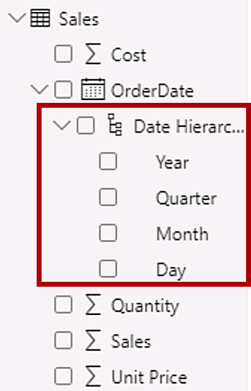
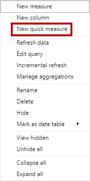
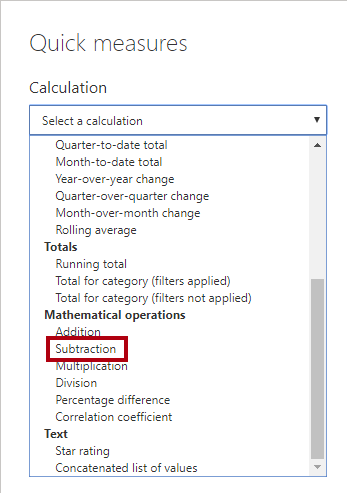
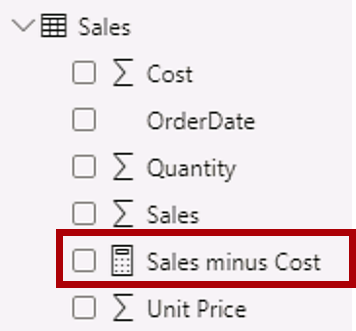
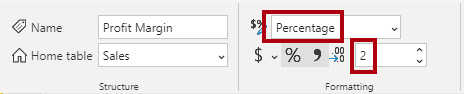
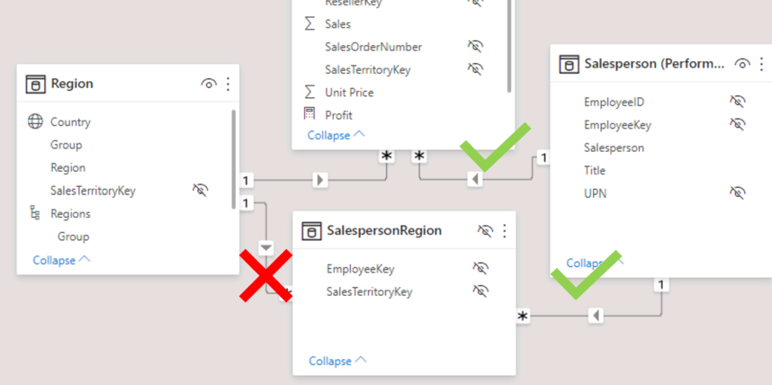

---
lab:
    title: 'Design a Data Model in Power BI'
    module: 'Design a Data Model in Power BI'
---

# Design a Data Model in Power BI

## **Lab story**

Trong phòng thí nghiệm này, bạn sẽ bắt đầu phát triển mô hình dữ liệu. Nó sẽ liên quan đến việc tạo mối quan hệ giữa các bảng, sau đó định cấu hình các thuộc tính của bảng và cột để cải thiện tính thân thiện và khả năng sử dụng của mô hình dữ liệu. Bạn cũng sẽ tạo hệ thống phân cấp và tạo các biện pháp nhanh chóng.

Trong phòng thí nghiệm này, bạn học cách:

- Tạo mối quan hệ mô hình
- Định cấu hình thuộc tính bảng và cột
- Tạo phân cấp

**Phòng thí nghiệm này sẽ mất khoảng 45 phút.**

## **Get started**

Trong nhiệm vụ này, bạn sẽ thiết lập môi trường cho phòng thí nghiệm.

1. Mở Power BI Desktop.

    

    *Mẹo: Theo mặc định, hộp thoại Bắt đầu sẽ mở ra trước Power BI Desktop. Bạn có thể chọn đăng nhập rồi đóng cửa sổ bật lên.*

1. Để mở tệp Power BI Desktop khởi động, hãy chọn **File > Open Report > Browse Reports**.

1. Điều hướng đến thư mục **D:\PL300\Labs\03-configure-data-model-in-power-bi-desktop\Starter**  và chọn file **Sales Analysis**.

1. Đóng mọi cửa sổ thông tin có thể mở.

1. Go to **File > Save As** and save the file to the **D:\PL300\MySolution** folder.

## **Create model relationships**

Trong nhiệm vụ này, bạn sẽ tạo các mối quan hệ mô hình. Tệp đã được định cấu hình để không xác định mối quan hệ giữa các bảng trong các phòng thí nghiệm trước đó. Đây không phải là cài đặt mặc định, nhưng được khuyến nghị để tránh làm thêm công việc tạo mối quan hệ chính xác cho mô hình của bạn.

*Quan trọng: Các phòng thí nghiệm sử dụng ký hiệu tốc ký để tham chiếu một trường. Nó sẽ trông như thế này: **Product \| Category**. Trong ví dụ này, **Product** là tên bảng và **Category** là tên trường.*

1. Trong Power BI Desktop, ở bên trái, hãy chọn biểu tượng dạng xem **Model**.

     

1. Nếu bạn không nhìn thấy tất cả bảy bảng, hãy cuộn theo chiều ngang sang bên phải, sau đó kéo và sắp xếp các bảng gần nhau hơn để có thể nhìn thấy tất cả chúng cùng một lúc.

     *Mẹo: Bạn cũng có thể sử dụng điều khiển thu phóng nằm ở cuối cửa sổ.*

1. Để quay lại chế độ xem Báo cáo, ở bên trái, hãy chọn biểu tượng chế độ xem **Report**.

     

1. Để xem tất cả các trường của bảng, trong ngăn **Data**, bấm chuột phải vào vùng trống rồi chọn **Expand All**.

1. Để tạo một bảng trực quan, trong ngăn **Data**, từ bên trong bảng **Product**, hãy chọn trường **Category**.

1. Để thêm một cột khác vào bảng, trong ngăn **Data**, hãy chọn **Sales \| Sales**.

1. Lưu ý rằng hình ảnh bảng liệt kê bốn danh mục sản phẩm và giá trị bán hàng giống nhau cho từng loại và giống nhau cho tổng số.

     * Vấn đề là bảng dựa trên các trường từ các bảng khác nhau. Kỳ vọng là mỗi danh mục sản phẩm sẽ hiển thị doanh số cho danh mục đó. Tuy nhiên, do không có mối quan hệ mô hình giữa các bảng này nên bảng **Sales** không được lọc. Bây giờ, bạn sẽ thêm một mối quan hệ để truyền các bộ lọc giữa các bảng.*

     

1. Trên tab dải băng **Modeling**, từ bên trong nhóm **Relationships**, hãy chọn **Manage Relationships**.

     

1. Trong cửa sổ **Manage Relationships**, lưu ý rằng chưa có mối quan hệ nào được xác định.

1. Để tạo mối quan hệ, hãy chọn **New**

1. Trong cửa sổ **Create Relationship**, trong danh sách thả xuống đầu tiên, hãy chọn bảng **Product**.

     

1. Trong danh sách thả xuống thứ hai (bên dưới lưới bảng **Product**), hãy chọn bảng **Sales**.

     

1. Lưu ý rằng các cột **ProductKey** trong mỗi bảng đã được chọn tự động.

	*Các cột được chọn vì chúng có cùng tên và kiểu dữ liệu. Bạn có thể cần tìm các cột khớp với các tên khác nhau trong dữ liệu thực.*

1. Trong danh sách thả xuống **Cardinality**, lưu ý rằng **One To Many (1:*)** được chọn.

     *Số lượng được tự động phát hiện vì Power BI hiểu rằng cột **ProductKey** từ bảng **Product** chứa các giá trị duy nhất. Mối quan hệ một-nhiều là mối quan hệ phổ biến nhất và tất cả mối quan hệ bạn tạo trong phòng thí nghiệm này sẽ thuộc loại này.*

1. Trong danh sách thả xuống **Cross Filter Direction**, lưu ý rằng **Single** được chọn.

     *Hướng bộ lọc đơn có nghĩa là bộ lọc lan truyền từ “một phía” sang “nhiều phía”. Trong trường hợp này, điều đó có nghĩa là các bộ lọc được áp dụng cho bảng **Product** sẽ truyền sang bảng **Sales**, nhưng không theo hướng ngược lại.*

1. Lưu ý rằng **Mark This Relationship Active** được chọn. 

     * Các mối quan hệ tích cực lan truyền các bộ lọc. Có thể đánh dấu một mối quan hệ là không hoạt động để các bộ lọc không lan truyền. Mối quan hệ không hoạt động có thể tồn tại khi có nhiều đường dẫn mối quan hệ giữa các bảng. Trong trường hợp này, tính toán mô hình có thể sử dụng các chức năng đặc biệt để kích hoạt chúng.*

Chọn **OK**, lưu ý trong cửa sổ **Manage Relationships** rằng mối quan hệ mới được liệt kê, sau đó chọn **Close**.

1.Lưu ý rằng hiện tại có một trình kết nối giữa hai bảng (không quan trọng nếu các bảng được đặt cạnh nhau).
     1. Bạn có thể diễn giải lực lượng được biểu thị bằng các chỉ báo **1** và **(*)**.
     1. Hướng lọc được thể hiện bằng đầu mũi tên.
     1. Đường liền nét thể hiện mối quan hệ đang hoạt động; một đường đứt nét thể hiện một mối quan hệ không hoạt động.
     1. Di con trỏ qua mối quan hệ để đánh dấu các cột có liên quan.

     

     Có một cách dễ dàng hơn để tạo mối quan hệ. Trong sơ đồ mô hình, bạn có thể kéo và thả các cột để tạo mối quan hệ mới.

1. Để tạo mối quan hệ mới bằng một kỹ thuật khác, từ bảng **Reseller**, hãy kéo cột **ResellerKey** vào cột **ResellerKey** của bảng **Sales**.

	*Mẹo: Đôi khi một cột không muốn được kéo. Nếu tình huống này phát sinh, hãy chọn một cột khác, rồi chọn lại cột mà bạn định kéo, rồi thử lại. Đảm bảo rằng bạn thấy mối quan hệ mới được thêm vào sơ đồ.*

     

1. Sử dụng kỹ thuật mới để tạo hai mối quan hệ mô hình sau:

     - **Region \| SalesTerritoryKey** to **Sales \| SalesTerritoryKey**
     - **Salesperson \| EmployeeKey** to **Sales \| EmployeeKey**

1. Trong sơ đồ, hãy sắp xếp các bảng sao cho bảng **Sales** nằm ở giữa sơ đồ và các bảng liên quan được sắp xếp xung quanh bảng đó. Đặt các bảng bị ngắt kết nối sang một bên.

     

1. Trong chế độ xem báo cáo, hãy lưu ý rằng hình ảnh bảng được cập nhật để hiển thị các giá trị khác nhau cho từng danh mục sản phẩm.

     *Các bộ lọc được áp dụng cho bảng **Product** hiện được áp dụng cho bảng **Sales**.*

     

1. Lưu tệp Power BI Desktop.

## **Configure Tables**

Trong bài tập này, bạn sẽ định cấu hình từng bảng bằng cách tạo cấu trúc phân cấp, ẩn, định dạng và phân loại cột.

## **Configure the Product table**

Trong tác vụ này, bạn sẽ định cấu hình bảng **Product**.

1. Trong chế độ xem Mô hình, trong ngăn **Data**, nếu cần, hãy mở rộng bảng **Product** để hiển thị tất cả các trường.

1. Để tạo cấu trúc phân cấp, trong ngăn **Data**, bấm chuột phải vào cột **Category** rồi chọn **Create Hierarchy**.

     

1. Trong ngăn **Properties** (ở bên trái ngăn **Data**), trong hộp **Name**, hãy thay thế văn bản bằng **Products**.

1. Để thêm cấp thứ hai vào hệ thống phân cấp, trong ngăn **Properties**, trong danh sách thả xuống **Hierarchy**, hãy chọn **Subcategory** (bạn có thể cần phải cuộn xuống bên trong ngăn).

1. Để thêm cấp thứ ba vào hệ thống phân cấp, trong danh sách thả xuống **Hierarchy**, hãy chọn **Product**.

1. Để hoàn thành thiết kế phân cấp, hãy chọn **Apply Level Changes**.

     

 	*Mẹo: Đừng quên chọn **Áp dụng thay đổi cấp độ**—việc bỏ qua bước này là một lỗi phổ biến.*

1. Trong ngăn **Data**, hãy chú ý hệ thống phân cấp **Products**.

     

1. Để hiển thị các cấp phân cấp, hãy mở rộng phân cấp **Products**.

     

1. Để sắp xếp các cột vào một thư mục hiển thị, trong ngăn **Data**, trước tiên hãy chọn cột **Background Color Format**.

1. Trong khi nhấn phím **Ctrl**, hãy chọn cột **Font Color Format**.

1. Trong ngăn **Properties**, trong hộp **Display Folder**, hãy nhập **Formatting**.

     

1. Trong ngăn **Data**, lưu ý rằng hai cột hiện nằm trong một thư mục.
    
   *Hiển thị các thư mục là một cách tuyệt vời để sắp xếp lại các bảng—đặc biệt là đối với các bảng chứa nhiều trường. Chúng chỉ được trình bày hợp lý.*

     

## **Configure the Region table**

Trong nhiệm vụ này, bạn sẽ định cấu hình bảng **Region**.

Trong bảng **Region**, hãy tạo một cấu trúc phân cấp có tên **Regions**, với ba cấp độ sau:

     - Group
     - Country
     - Region

     

1. Chọn cột **Country** (không phải cấp phân cấp (hierarchy level) **Country**).

1. Trong ngăn **Properties**, hãy mở rộng phần **Advanced** (ở cuối ngăn), sau đó trong danh sách thả xuống **Data Category**, hãy chọn **Country/Region**.

     * Phân loại dữ liệu có thể cung cấp gợi ý cho người thiết kế báo cáo. Trong trường hợp này, việc phân loại cột theo quốc gia hoặc khu vực sẽ cung cấp thông tin chính xác hơn cho Power BI khi nó hiển thị trực quan hóa bản đồ.*

     

## **Configure the Reseller table**

Trong nhiệm vụ này, bạn sẽ định cấu hình bảng **Reseller** 

1. Trong bảng **Reseller**, hãy tạo một cấu trúc phân cấp có tên **Resellers**, với hai cấp độ sau:

     - Business Type
     - Reseller

1. Tạo cấu trúc phân cấp thứ hai có tên **Geography**, với bốn cấp độ sau:

     - Country-Region
     - State-Province
     - City
     - Reseller

1. Set the **Data Category** for the **Country-Region**, **State-Province**, and **City** columns (not the hierarchy level) to **Country/Region**, **State or Province**, and **City**, respectively.

Đặt **ata Category** cho các cột **Country-Region**, **State-Province** và **City** (không phải cấp phân cấp) thành **Country/Region**, **State or Province** và **City** tương ứng.

## **Configure the Sales table**

Trong tác vụ này, bạn sẽ định cấu hình bảng **Sales**.

1. Trong bảng **Sales**, hãy chọn cột **Cost**.

1. Trong ngăn **Properties**, trong hộp **Description**, hãy nhập: *Based on standard cost*.

     *Mô tả có thể được áp dụng cho bảng, cột, hệ thống phân cấp hoặc thước đo. Trong ngăn **Data**, văn bản mô tả được hiển thị trong chú giải công cụ khi tác giả báo cáo di chuột qua trường.*

1. Chọn cột **Quantity**.

1. Trong ngăn **Properties**, từ bên trong phần **Formatting**, hãy trượt thuộc tính **Thousands Separator** sang **Yes**.

1. Chọn cột **Unit Price**.

1. Trong ngăn **Properties**, từ bên trong phần **Formatting**, hãy đặt thuộc tính **Decimal Places** thành **2**.

1. Trong nhóm **Advanced** (bạn có thể phải cuộn xuống để tìm nhóm đó), trong danh sách thả xuống **Summarize By**, hãy chọn **Average**.

     *Theo mặc định, các cột số sẽ tóm tắt bằng cách cộng các giá trị lại với nhau. Hành vi mặc định này không phù hợp với cột như **Unit Price**, đại diện cho một mức giá. Đặt tóm tắt mặc định thành trung bình sẽ tạo ra kết quả có ý nghĩa.*

## **Bulk update properties**

In this task, you'll update multiple columns using single bulk updates. You'll use this approach to hide columns, and format column values.

Trong tác vụ này, bạn sẽ cập nhật nhiều cột bằng cách sử dụng các bản cập nhật hàng loạt. Bạn sẽ sử dụng phương pháp này để ẩn cột và định dạng giá trị cột.

1. Trong ngăn **Data**, chọn **Product \| ProductKey** cột.

1. Trong khi nhấn phím **Ctrl**, hãy chọn 13 cột sau (mở rộng trên nhiều bảng):

     - Region \| SalesTerritoryKey
     - Reseller \| ResellerKey
     - Sales \| EmployeeKey
     - Sales \| ProductKey
     - Sales \| ResellerKey
     - Sales \| SalesOrderNumber
     - Sales \| SalesTerritoryKey
     - Salesperson \| EmployeeID
     - Salesperson \| EmployeeKey
     - Salesperson \| UPN
     - SalespersonRegion \| EmployeeKey
     - SalespersonRegion \| SalesTerritoryKey
     - Targets \| EmployeeID

1. Trong ngăn **Properties**, hãy trượt thuộc tính **Is Hidden** thành **Yes**.

     *Các cột bị ẩn vì chúng được sử dụng bởi các mối quan hệ hoặc sẽ được sử dụng trong logic tính toán hoặc cấu hình bảo mật cấp hàng.*

     *Bạn sẽ sử dụng **SalesOrderNumber** để tính toán trong phòng thí nghiệm **Create DAX Calculations in Power BI Desktop**.*

1. Chọn nhiều ba cột sau

     - Product \| Standard Cost
     - Sales \| Cost
     - Sales \| Sales

1. Trong ngăn **Properties**, từ bên trong phần **Formatting**, hãy đặt thuộc tính **Decimal Places** thành **0** (không).

## **Review the Model Interface**

Trong bài tập này, bạn sẽ chuyển sang chế độ xem Báo cáo và xem xét giao diện mô hình.

## **Review the model interface**

Trong nhiệm vụ này, bạn sẽ chuyển sang chế độ xem Báo cáo và xem xét giao diện mô hình.

1. Chuyển sang chế độ xem Báo cáo.

1. Trong ngăn **Data**, hãy chú ý những điều sau:

     - Các cột, phân cấp và cấp độ của chúng là các trường, có thể được sử dụng để định cấu hình hình ảnh báo cáo
      - Chỉ các trường liên quan đến việc tạo báo cáo mới được hiển thị
      - Bảng **SalespersonRegion** không hiển thị—vì tất cả các trường của bảng đều bị ẩn
      - Các trường không gian trong bảng **Region** và **Reseller** được tô điểm bằng biểu tượng không gian
      - Theo mặc định, các trường được trang trí bằng ký hiệu sigma (Ʃ) sẽ tóm tắt
      - Chú giải công cụ xuất hiện khi di con trỏ qua **Sales \| Cost**

1. Mở rộng **Sales \| OrderDate** và sau đó lưu ý rằng trường này hiển thị phân cấp ngày.

     *Các **Targets \| TargetMonth** cung cấp một hệ thống phân cấp tương tự. Những hệ thống phân cấp này không phải do bạn tạo ra. Chúng được tạo tự động. Tuy nhiên, có một vấn đề. Năm tài chính của Adventure Works bắt đầu vào ngày 1 tháng 7 hàng năm. Tuy nhiên, trong các hệ thống phân cấp ngày được tạo tự động này, năm phân cấp ngày bắt đầu vào ngày 1 tháng 1 hàng năm.*

     

 Bây giờ bạn sẽ tắt hành vi tự động này. Trong phòng thí nghiệm **Create DAX Calculations in Power BI Desktop**, bạn sẽ sử dụng DAX để tạo bảng ngày và định cấu hình bảng này để xác định lịch của Adventure Works.

1. Để tắt tự động/ngày giờ, hãy điều hướng đến nhóm **File > Options and Settings > Options > Current File** và chọn **Data Load**.

    1. Trong phần **Time Intelligence**, bỏ chọn **Auto Date/Time**.

     

1. Trong ngăn **Data**, lưu ý rằng hệ thống phân cấp ngày không còn nữa.
     

## **Create Quick Measures**

Trong bài tập này, bạn sẽ tạo hai thước đo nhanh.

## **Create quick measures**

Trong nhiệm vụ này, bạn sẽ tạo hai thước đo nhanh để tính toán lợi nhuận và tỷ suất lợi nhuận.

*Một phép đo nhanh tạo ra công thức tính toán cho bạn. Chúng dễ dàng và nhanh chóng được tạo cho các phép tính đơn giản và phổ biến. Bạn sẽ tạo các thước đo mà không cần sử dụng công cụ này trong phòng thí nghiệm **Create DAX Calculations in Power BI Desktop**.*

1. In the **Data** pane, right-click the **Sales** table, and then select **New Quick Measure**.

Trong ngăn **Data**, bấm chuột phải vào bảng **Sales** rồi chọn **New Quick Measure**.

     

1. Trong cửa sổ **Quick Measures**, trong danh sách thả xuống **Calculation**, từ bên trong nhóm **Mathematical Operations**, chọn **Subtraction**.

     

1. Trong khung **Data** của cửa sổ **Quick Measures**, hãy mở rộng bảng **Sales**.

1. Kéo trường **Sales** vào hộp **Base Value**.

1. Kéo trường **Cost** vào hộp **Value to Subtract**.

     

1. Trong ngăn **Data**, bên trong bảng **Sales**, hãy lưu ý thước đo mới đó.
    1. *Measures use the calculator icon.*

     

1. Để đổi tên thước đo, nhấp chuột phải vào thước đo đó, chọn **Rename**, sau đó đổi tên thành **Profit**.

     *Mẹo: Để đổi tên một trường, bạn cũng có thể bấm hai lần vào trường đó hoặc chọn trường đó rồi nhấn **F2**.*

1. Trong bảng **Sales**, hãy thêm thước đo nhanh thứ hai, dựa trên các yêu cầu sau:

     - Sử dụng phép toán **Division**
     - Đặt **Numerator** thành **Sales \| Profit**
     - Đặt **Denominator** thành **Sales \| Sales**
     - Đổi tên thước đo thành **Profit Margin**

1. Đảm bảo thước đo **Profit Margin** được chọn, sau đó trên dải băng theo ngữ cảnh **Measure Tools**, hãy đặt định dạng thành **Percentage**, với hai chữ số thập phân.

     

1. Để kiểm tra hai biện pháp, trước tiên hãy chọn **table** trực quan trên trang báo cáo.

1. Trong ngăn **Data**, hãy kiểm tra hai thước đo.

     

1. Chọn và kéo hướng dẫn bên phải để mở rộng hình ảnh bảng.

     

1. Xác minh rằng các biện pháp tạo ra kết quả hợp lý được định dạng chính xác.

     

## **Create a many-to-many relationship**

Trong tác vụ này, bạn sẽ tạo mối quan hệ nhiều-nhiều giữa bảng **Salesperson** và bảng **Sales**.

 * Các phòng thí nghiệm sử dụng ký hiệu tốc ký để tham chiếu một trường. Nó sẽ trông như thế này: **Salesperson \| Salesperson** . Trong ví dụ này, **Salesperson** là tên bảng và **Salesperson** là tên trường.*

1. Trong Power BI Desktop, ở chế độ xem Báo cáo, trong ngăn **Data**, hãy chọn hai trường sau để tạo **table** trực quan.

     - Salesperson \| Salesperson
     - Sales \| Sales

     

     *Bảng hiển thị doanh số được thực hiện bởi từng nhân viên bán hàng. Tuy nhiên, có một mối quan hệ khác giữa nhân viên bán hàng và bán hàng. Một số nhân viên bán hàng thuộc một, hai hoặc có thể nhiều khu vực bán hàng hơn. Ngoài ra, các khu vực bán hàng có thể được chỉ định nhiều nhân viên bán hàng.*

     *Từ góc độ quản lý hiệu suất, doanh số bán hàng của nhân viên bán hàng (dựa trên lãnh thổ được chỉ định của họ) cần được phân tích và so sánh với các mục tiêu bán hàng. Bạn sẽ tạo các mối quan hệ để hỗ trợ phân tích này trong bài tập tiếp theo.*

1. Lưu ý rằng **Michael Blythe** đã bán được gần 9 triệu đô la.

1. Chuyển sang chế độ xem Mô hình, sau đó kéo bảng **SalespersonRegion** để định vị bảng đó giữa các bảng **Region** và **Salesperson**.

1. Sử dụng kỹ thuật kéo và thả để tạo hai mối quan hệ mô hình sau:

     - **Salesperson \| EmployeeKey** to **SalespersonRegion \| EmployeeKey**
     - **Region \| SalesTerritoryKey** to **SalespersonRegion \| SalesTerritoryKey**

    *Bảng **SalespersonRegion** có thể được coi là bảng bắc cầu.*

1. Chuyển sang chế độ xem Báo cáo và sau đó nhận thấy rằng hình ảnh chưa được cập nhật—kết quả bán hàng cho Michael Blythe không thay đổi.

1. Chuyển về chế độ xem Mô hình, sau đó làm theo hướng dẫn của bộ lọc mối quan hệ (đầu mũi tên) từ bảng **Salesperson**.

     *Hãy xem xét rằng bảng **Salesperson** lọc bảng **Sales**. Nó cũng lọc bảng **SalespersonRegion**, nhưng nó không tiếp tục bằng cách truyền các bộ lọc sang bảng **Region** (đầu mũi tên chỉ sai hướng).*

     

1. Để chỉnh sửa mối quan hệ giữa bảng **Region** và **SalespersonRegion**, hãy bấm đúp vào mối quan hệ.

1. Trong cửa sổ **Edit Relationship**, trong danh sách thả xuống **Cross Filter Direction**, hãy chọn **Both**.

1. Chọn hộp kiểm **Apply Security Filter in Both Directions**, sau đó chọn OK.

     

1. Lưu ý rằng mối quan hệ hiện có một đầu mũi tên kép.

     

1. Chuyển sang chế độ xem Báo cáo và sau đó nhận thấy rằng các giá trị bán hàng vẫn không thay đổi.

     *Vấn đề hiện liên quan đến thực tế là có thể có hai đường dẫn truyền bộ lọc giữa bảng **Salesperson** và bảng **Sales**. Sự mơ hồ này được giải quyết nội bộ, dựa trên đánh giá “số lượng bảng ít nhất”. Để rõ ràng, bạn không nên thiết kế các mô hình với kiểu mơ hồ này—vấn đề sẽ được giải quyết một phần sau trong phòng thí nghiệm này và khi hoàn thành phòng thí nghiệm **Create DAX Calculations in Power BI Desktop**.*

1. Chuyển sang chế độ xem Mô hình để buộc truyền bộ lọc qua bảng bắc cầu. Chỉnh sửa (bấm đúp) vào mối quan hệ giữa bảng **Salesperson** và bảng **Sales**.

1.Trong cửa sổ **Edit Relationship**, bỏ chọn hộp kiểm **Make This Relationship Active** và chọn **OK**.

     *Việc lan truyền bộ lọc bây giờ sẽ đi theo đường dẫn hoạt động duy nhất.*

1. Trong sơ đồ, hãy lưu ý rằng mối quan hệ không hoạt động được thể hiện bằng một đường đứt nét.

     

1. Chuyển sang chế độ xem Báo cáo và sau đó nhận thấy rằng doanh thu của Michael Blythe hiện là gần 22 triệu đô la.

     

1. Cũng lưu ý rằng doanh thu của mỗi nhân viên bán hàng - nếu được thêm vào - sẽ vượt quá tổng số của bảng.

     * Đó là một quan sát phổ biến về mối quan hệ nhiều-nhiều do tính gấp đôi, gấp ba, v.v. của kết quả bán hàng trong khu vực. Hãy xem Brian Welcker, nhân viên bán hàng thứ hai được liệt kê. Số tiền bán hàng của anh ta bằng tổng số tiền bán hàng. Đó là kết quả chính xác vì anh ấy là Giám đốc Kinh doanh; doanh số bán hàng của anh ấy được đo bằng doanh số bán hàng của tất cả các khu vực.*

     *Mặc dù mối quan hệ nhiều-nhiều hiện đang hoạt động, nhưng hiện tại không thể phân tích doanh số bán hàng do nhân viên bán hàng thực hiện (vì mối quan hệ không hoạt động). Bạn sẽ có thể kích hoạt lại mối quan hệ khi giới thiệu một bảng được tính toán cho phép phân tích doanh số bán hàng được thực hiện trong (các) khu vực bán hàng được chỉ định cho nhân viên bán hàng (để phân tích hiệu suất) trong **Create DAX Calculations in Power BI Desktop** phòng thí nghiệm.*

1. Chuyển sang dạng xem Lập mô hình, rồi trong sơ đồ, chọn bảng **Salesperson**.

1. Trong ngăn **Properties**, trong hộp **Tên**, hãy thay thế văn bản bằng **Salesperson (Performance)**.

*Bảng được đổi tên hiện phản ánh mục đích của nó: nó được sử dụng để báo cáo và phân tích hiệu suất của nhân viên bán hàng dựa trên doanh số bán hàng của các khu vực bán hàng được chỉ định của họ.*

## **Relate the Targets table**

Trong tác vụ này, bạn sẽ tạo mối quan hệ với bảng **Targets**

1. Tạo mối quan hệ từ **Salesperson (Performance) \| EmployeeID** và **Targets \| EmployeeID**.

1. Trong chế độ xem Báo cáo, hãy thêm **Targets \| Target** vào bảng trực quan.

1. Thay đổi kích thước trực quan của bảng để tất cả các cột đều hiển thị.

     

 *Giờ đây, bạn có thể hình dung doanh số bán hàng và mục tiêu—nhưng hãy cẩn thận vì hai lý do. Đầu tiên, không có bộ lọc trong một khoảng thời gian và do đó, mục tiêu cũng bao gồm số tiền mục tiêu trong tương lai. Thứ hai, các mục tiêu không phải là phụ gia và do đó, tổng số sẽ không được hiển thị. Chúng có thể bị vô hiệu hóa bằng cách định dạng hình ảnh hoặc loại bỏ bằng cách sử dụng logic tính toán. Bạn sẽ làm theo phương pháp thứ hai bằng cách tạo thước đo mục tiêu trong phòng thí nghiệm **Create Advanced DAX Calculations in Power BI Desktop**. Thao tác này sẽ trả về TRỐNG khi có nhiều nhân viên bán hàng được lọc.*

### **Finish up**

Trong nhiệm vụ này, bạn sẽ hoàn thành phòng thí nghiệm.

Lưu tệp Power BI Desktop và chọn **Apply Later** nếu được nhắc áp dụng truy vấn.
