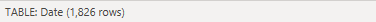
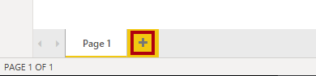
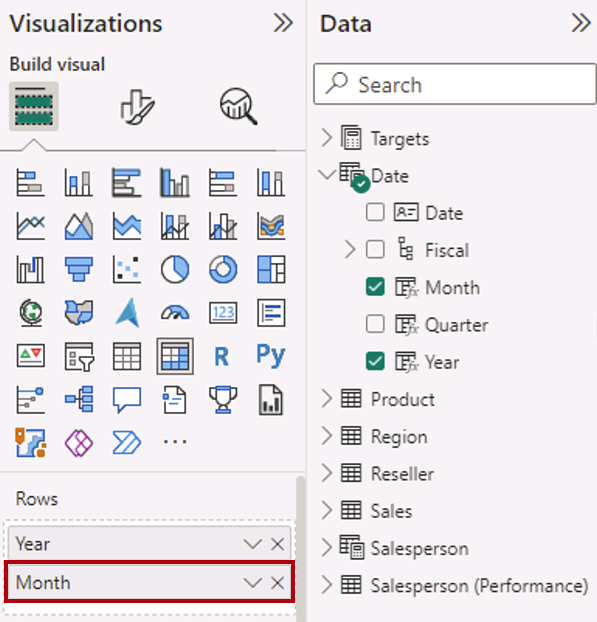

---
lab:
    title: 'Create DAX Calculations in Power BI Desktop'
    module: 'Create Model Calculations using DAX in Power BI'
---


# Create DAX Calculations in Power BI Desktop

## **Lab story**

Trong phòng thí nghiệm này, bạn sẽ tạo các bảng được tính toán, các cột được tính toán và các thước đo đơn giản bằng Biểu thức Phân tích Dữ liệu (Data Analysis Expressions - DAX).

Trong phòng thí nghiệm này, bạn học cách:

- Tạo bảng tính toán
- Tạo cột tính toán
- Tạo measures

**Phòng thí nghiệm này sẽ mất khoảng 45 phút.**

## **Create Calculated Tables**

Trong bài tập này, bạn sẽ tạo hai bảng tính toán. Đầu tiên sẽ là bảng **Salesperson**, để cho phép mối quan hệ trực tiếp giữa bảng này và bảng **Sales**. Thứ hai sẽ là bảng **Date**.

*Quan trọng: Nếu bạn đang tiếp tục từ phòng thí nghiệm trước (và bạn đã hoàn thành bài thí nghiệm đó thành công), thì đừng hoàn thành nhiệm vụ này; thay vào đó, hãy tiếp tục từ nhiệm vụ tiếp theo.*

1. Mở Power BI Desktop.

    

	*Mẹo: Theo mặc định, hộp thoại Bắt đầu sẽ mở ra trước Power BI Desktop. Bạn có thể chọn đăng nhập rồi đóng cửa sổ bật lên.*

1. Để mở tệp Power BI Desktop khởi động, hãy chọn **File > Open Report > Browse Reports**.

1. Trong cửa sổ **Open**, điều hướng đến thư mục **D:\PL300\Labs\04-create-dax-calculations-in-power-bi-desktop\Starter** và mở **Sales Analysis* * tài liệu.

1. Đóng mọi cửa sổ thông tin có thể mở.

1. Lưu ý thông báo cảnh báo màu vàng bên dưới dải băng.

	*Thông báo này thông báo cho bạn biết rằng các truy vấn chưa được áp dụng để tải dưới dạng bảng mô hình. Bạn sẽ áp dụng các truy vấn sau trong phòng thí nghiệm này.*

	*Để loại bỏ thông báo cảnh báo, ở bên phải thông báo cảnh báo màu vàng, hãy chọn **X**.*

1. Để tạo một bản sao của tệp, hãy chuyển đến **File > Save As** và lưu vào thư mục **D:\PL300\MySolution**.

1. Nếu được nhắc áp dụng các thay đổi, hãy chọn **Apply Later**.

## **Create the Salesperson table**

Trong nhiệm vụ này, bạn sẽ tạo bảng tính toán **Salesperson** (có mối quan hệ trực tiếp với **Sales**).

Một bảng được tính toán được tạo bằng cách nhập tên bảng trước tiên, tiếp theo là ký hiệu bằng (=), tiếp theo là công thức DAX trả về một bảng. Tên bảng không được tồn tại trong mô hình dữ liệu.

Thanh công thức hỗ trợ nhập công thức DAX hợp lệ. Nó bao gồm các tính năng như tự động hoàn thành, Intellisense và mã màu, cho phép bạn nhập công thức một cách nhanh chóng và chính xác.

1. Trong Power BI Desktop, ở chế độ xem Báo cáo, trên dải băng **Modeling**, từ bên trong nhóm **Calculations**, chọn **New Table**.

     

2. Trong thanh công thức (mở ngay bên dưới ruy-băng khi tạo hoặc chỉnh sửa phép tính), nhập **Salesperson =**, nhấn **Shift+Enter**, nhập **'Salesperson (Performance)'**, rồi nhấn **Enter**.

	*Để thuận tiện cho bạn, tất cả các định nghĩa DAX trong phòng thí nghiệm này có thể được sao chép từ tệp đoạn trích, nằm trong

	**D:\PL300\Labs\04-create-dax-calculations-in-power-bi-desktop\Assets\Snippets.txt**.*

	 

	 *Định nghĩa bảng này tạo một bản sao của bảng **Salesperson (Performance)**. Nó chỉ sao chép dữ liệu, tuy nhiên các thuộc tính của mô hình như khả năng hiển thị, định dạng, v.v. không được sao chép.*

      *Mẹo: Bạn nên nhập “khoảng trắng” (tức là, dấu xuống dòng và tab) để viết công thức ở định dạng trực quan và dễ đọc—đặc biệt là khi công thức dài và phức tạp. Để nhập xuống dòng, nhấn **Shift+Enter**. “Khoảng trắng” là tùy chọn.*

1. Trong ngăn **Data**, hãy lưu ý rằng biểu tượng bảng có màu xanh lam (biểu thị bảng được tính toán).

	
	
	*Lưu ý: Các bảng được tính toán được xác định bằng cách sử dụng công thức DAX trả về một bảng. Điều quan trọng là phải hiểu rằng các bảng được tính toán làm tăng kích thước của mô hình dữ liệu vì chúng cụ thể hóa và lưu trữ các giá trị. Chúng được tính toán lại bất cứ khi nào các phần phụ thuộc của công thức được làm mới, giống như trường hợp của mô hình dữ liệu này khi các giá trị ngày (trong tương lai) mới được tải vào bảng.*

	*Không giống như các bảng có nguồn gốc từ Power Query, không thể sử dụng các bảng đã tính toán để tải dữ liệu từ các nguồn dữ liệu ngoài. Họ chỉ có thể chuyển đổi dữ liệu dựa trên những gì đã được tải vào mô hình dữ liệu.*

1. Switch to Model view, and notice that the **Salesperson** table is available (you may need to reset view to find table).

1. Chuyển sang chế độ xem Mô hình và nhận thấy rằng bảng **Salesperson** có sẵn (bạn có thể cần đặt lại chế độ xem để tìm bảng).

1. Tạo mối quan hệ từ **Salesperson \| EmployeeKey** vào **Sales \| EmployeeKey**.

1. Bấm chuột phải vào mối quan hệ không hoạt động giữa các bảng **Salesperson (Performance)** và **Sales**, sau đó chọn **Delete**. Khi được nhắc xác nhận việc xóa, hãy chọn **Yes**.

1. Trong bảng **Salesperson**, hãy chọn nhiều cột sau đây rồi ẩn chúng (đặt thuộc tính **Is Hidden** thành **Yes**):

	- EmployeeID
	- EmployeeKey
	- UPN

1. Trong sơ đồ mô hình, hãy chọn bảng **Salesperson**.

1. Trong ngăn **Properties**, trong hộp **Description**, hãy nhập: **Salesperson related to Sales**
    
	*Bạn có thể nhớ rằng các mô tả xuất hiện dưới dạng chú giải công cụ trong ngăn *Data** khi người dùng di con trỏ qua một bảng hoặc trường.*

1. Đối với bảng **Salesperson (Performance)**, hãy đặt mô tả thành: **Salesperson related to region(s)**

*Mô hình dữ liệu hiện cung cấp hai lựa chọn thay thế khi phân tích nhân viên bán hàng. Bảng **Salesperson** cho phép phân tích doanh số bán hàng do nhân viên bán hàng thực hiện, trong khi bảng **Salesperson (Performance)** cho phép phân tích doanh số bán hàng được thực hiện trong (các) khu vực bán hàng được chỉ định cho nhân viên bán hàng đó.*

## **Create the Date table**

Trong tác vụ này, bạn sẽ tạo bảng **Date**.

1. Chuyển sang chế độ xem Dữ liệu. Trên tab dải băng **Home**, từ bên trong nhóm **Calculations**, hãy chọn **New Table**.

	

1. Trong thanh công thức, nhập như sau:

	**DAX**

	```
	Date =  
	CALENDARAUTO(6)
	```

	

	*Hàm CALENDARAUTO() trả về một bảng một cột bao gồm các giá trị ngày. Hành vi "Auto" quét tất cả các cột ngày của mô hình dữ liệu để xác định giá trị ngày sớm nhất và mới nhất được lưu trữ trong mô hình dữ liệu. Sau đó, nó tạo một hàng cho mỗi ngày trong phạm vi này, mở rộng phạm vi theo một trong hai hướng để đảm bảo lưu trữ dữ liệu đầy đủ trong nhiều năm.*

	* Hàm này có thể nhận một đối số tùy chọn duy nhất là số tháng cuối cùng của một năm. Khi bị bỏ qua, giá trị là 12, nghĩa là tháng 12 là tháng cuối cùng của năm. Trong trường hợp này, 6 được nhập, nghĩa là tháng 6 là tháng cuối cùng của năm.*

1. Lưu ý cột giá trị ngày tháng
	

	*Ngày hiển thị được định dạng bằng cách sử dụng cài đặt khu vực của Hoa Kỳ (nghĩa là mm/dd/yyyy).*

5. Ở góc dưới cùng bên trái, trong thanh trạng thái, hãy chú ý thống kê bảng, xác nhận rằng 1826 hàng dữ liệu đã được tạo, đại diện cho dữ liệu của 5 năm đầy đủ.

	

## **Create calculated columns**

Trong tác vụ này, bạn sẽ thêm nhiều cột hơn để cho phép lọc và nhóm theo các khoảng thời gian khác nhau. Bạn cũng sẽ tạo một cột được tính toán để kiểm soát thứ tự sắp xếp của các cột khác.

*Để thuận tiện cho bạn, tất cả các định nghĩa DAX trong phòng thí nghiệm này có thể được sao chép từ tệp đoạn trích, nằm trong **D:\PL300\Labs\04-create-dax-calculations-in-power-bi-desktop\Assets\Snippets.txt**.*

1. Trên dải băng ngữ cảnh **Table Tools**, từ bên trong nhóm **Calculations**, chọn **New Column**.

	

1. Trong thanh công thức, hãy nhập nội dung sau (hoặc sao chép từ tệp đoạn trích), rồi nhấn **Enter**:


	**DAX**


	```
	Year =
	"FY" & YEAR('Date'[Date]) + IF(MONTH('Date'[Date]) > 6, 1)
	```


	*Cột được tính toán được tạo bằng cách nhập tên cột trước tiên, tiếp theo là ký hiệu bằng (=), tiếp theo là công thức DAX trả về kết quả một giá trị. Tên cột không được tồn tại trong bảng.*

	*Công thức sử dụng giá trị năm của ngày nhưng thêm một vào giá trị năm khi tháng sau tháng Sáu. Đó là cách tính các năm tài chính tại Adventure Works.*

2. Xác minh rằng cột mới đã được thêm vào.

	

1. Sử dụng định nghĩa tệp đoạn trích để tạo hai cột được tính toán sau đây cho bảng **Date**:

	- Quarter
	- Month

	

	- Quarter = 
	'Date'[Year] & " Q"
		& IF(
			MONTH('Date'[Date]) <= 3,
			3,
			IF(
				MONTH('Date'[Date]) <= 6,
				4,
				IF(
					MONTH('Date'[Date]) <= 9,
					1,
					2
				)
			)
		)
	- Month = FORMAT('Date'[Date], "yyyy MMM")

1. Để xác thực các phép tính, hãy chuyển sang chế độ xem Báo cáo.

1. Để tạo một trang báo cáo mới, hãy chọn biểu tượng dấu cộng bên cạnh Page 1.

	

1. Để thêm hình ảnh ma trận vào trang báo cáo mới, trong ngăn **Visualizations**, hãy chọn **Matrix**.

	*Mẹo: Bạn có thể di con trỏ qua từng biểu tượng để hiển thị chú giải công cụ mô tả loại hình ảnh.*

	

1. Trong ngăn **Data**, từ bên trong bảng **Date**, hãy kéo trường **Year** vào ô/khu vực **Rows**.

	

1. Kéo trường **Month** vào ô/khu vực **Rows**, ngay bên dưới trường **Year**.
	

1. Ở trên cùng bên phải của hình ảnh ma trận (hoặc dưới cùng, tùy thuộc vào vị trí của hình ảnh), chọn biểu tượng mũi tên chia đôi (sẽ mở rộng tất cả các năm xuống một cấp).

	

1. Lưu ý rằng năm mở rộng thành tháng và các tháng được sắp xếp theo thứ tự bảng chữ cái thay vì thứ tự thời gian.

	

	*Theo mặc định, giá trị văn bản sắp xếp theo thứ tự bảng chữ cái, số sắp xếp từ nhỏ nhất đến lớn nhất và ngày tháng sắp xếp từ sớm nhất đến mới nhất.*

1. Để tùy chỉnh thứ tự sắp xếp trường **Month**, hãy chuyển sang Chế độ xem dữ liệu

1. Thêm cột **MonthKey** vào bảng **Date**.

	**DAX**


	```
	MonthKey =
	(YEAR('Date'[Date]) * 100) + MONTH('Date'[Date])
	```

	*Công thức này tính giá trị số cho mỗi tổ hợp year/month.*

1. Trong chế độ xem Dữ liệu, hãy xác minh rằng cột mới chứa các giá trị số (ví dụ: 201707 cho tháng 7 năm 2017, v.v.).

	

1. Chuyển về chế độ xem Data. Trong ngăn **Data**, đảm bảo rằng trường **Month** được chọn (khi được chọn, trường này sẽ có nền màu xám đậm).

1. Trên dải băng theo ngữ cảnh **Column Toolst**, từ bên trong nhóm **Sort**, chọn **Sort by Column**, sau đó chọn **MonthKey**.

	

1. Trong hình ảnh ma trận, lưu ý rằng các tháng hiện được sắp xếp theo thứ tự thời gian.

	

## **Complete the Date table**

Trong nhiệm vụ này, bạn sẽ hoàn thành việc thiết kế bảng **Date** bằng cách ẩn một cột và tạo cấu trúc phân cấp. Sau đó, bạn sẽ tạo mối quan hệ với các bảng **Sales** và **Targets**.

1. Chuyển sang chế độ xem Mô hình. Trong bảng **Date**, hãy ẩn cột **MonthKey** (đặt **Is Hidden** thành **Yes**).

1. Trên ngăn bên phải **Data**, hãy chọn bảng **Date**, chọn bên phải trên cột **Year** và chọn **create hierarchy**.

1. Đổi tên cấu trúc phân cấp mới tạo thành **Fiscal** bằng cách chọn phải và **Rename**.

1. Thêm hai trường còn lại tiếp theo vào hệ thống phân cấp Tài chính bằng cách chọn chúng trong ngăn **Data**, nhấp chuột phải, chọn **Add to hierarchy** -> **Fiscal**.

	- Quarter
	- Month

	

1. Tạo hai mối quan hệ mô hình sau:

	- **Date \| Date** to **Sales \| OrderDate**
	- **Date \| Date** to **Targets \| TargetMonth**

1. Ẩn hai cột sau:

	- Sales \| OrderDate
	- Targets \| TargetMonth

## **Mark the Date table**

Trong nhiệm vụ này, bạn sẽ đánh dấu bảng **Date** là bảng ngày tháng.

1. Chuyển sang chế độ Data. Trong ngăn **Data**, hãy chọn bảng **Date** (không phải trường **Date**).

1. Trên dải băng ngữ cảnh **Table Tools**, từ bên trong nhóm **Calendars**, chọn **Mark as Date Table**, sau đó chọn **Mark as Date Table**.

	

1. Trong cửa sổ **Mark as Date Table**, trong danh sách thả xuống **Date Column**, hãy chọn **Date**. Chọn **OK**.

	

1. Lưu tệp Power BI Desktop.

	*Power BI Desktop hiện hiểu rằng bảng này xác định ngày (giờ). Nó rất quan trọng khi dựa vào tính toán thông minh về thời gian. Bạn sẽ làm việc với các tính toán thông minh về thời gian trong phòng thí nghiệm **Create Advanced DAX Calculations in Power BI Desktop**.*

	*Phương pháp thiết kế bảng ngày này phù hợp khi bạn không có bảng ngày trong nguồn dữ liệu của mình. Nếu bạn có một kho dữ liệu, thì việc tải dữ liệu ngày từ bảng thứ nguyên ngày của nó sẽ phù hợp hơn là logic “xác định lại” ngày trong mô hình dữ liệu của bạn.*

## **Create simple measures**

Trong nhiệm vụ này, bạn sẽ tạo các biện pháp đơn giản. Các biện pháp đơn giản tổng hợp các giá trị trong một cột hoặc đếm các hàng của bảng.

1. Trong chế độ xem Báo cáo, trên **Page 2**, trong ngăn **Data**, hãy kéo **Sales \| Unit Price** vào ma trận trực quan.

	* Các phòng thí nghiệm sử dụng ký hiệu tốc ký để tham chiếu một trường. Nó sẽ trông như thế này: **Sales \| Unit Price**. Trong ví dụ này, **Sales** là tên bảng và **Unit Price** là tên trường.*

	

	*Bạn có thể nhớ rằng trong phòng thí nghiệm **Model Data in Power BI Desktop**, bạn đặt cột **Unit Price** để tóm tắt theo **Average**. Kết quả bạn nhìn thấy trong hình ảnh ma trận là đơn giá trung bình hàng tháng (tổng giá trị đơn giá chia cho số lượng đơn giá).*

1. Trong ngăn trường trực quan (nằm bên dưới ngăn **Visualizations**), trong ô/khu vực trường **Values**, hãy lưu ý rằng **Unit Price** được liệt kê.

	

1. Chọn mũi tên xuống cho **Unit Price**, sau đó để ý các tùy chọn menu có sẵn.

	

	*Các cột số hiển thị cho phép tác giả báo cáo tại thời điểm thiết kế báo cáo quyết định cách các giá trị cột sẽ tóm tắt (hoặc không). Nó có thể dẫn đến báo cáo không phù hợp. Tuy nhiên, một số người lập mô hình dữ liệu không muốn để mọi thứ ngẫu nhiên và chọn ẩn các cột này và thay vào đó hiển thị logic tổng hợp được xác định trong các biện pháp. Đó là cách tiếp cận mà bạn sẽ thực hiện trong phòng thí nghiệm này.*

1. Để tạo thước đo, trong ngăn **Data**, nhấp chuột phải vào bảng **Sales**, sau đó chọn **New Measure**.

1. Trong thanh công thức, thêm định nghĩa thước đo sau:


	**DAX**


	```
	Avg Price =  
	AVERAGE(Sales[Unit Price])
	```

1. Thêm thước đo **Avg Price** vào hình ảnh ma trận.

1. Lưu ý rằng cột này tạo ra kết quả giống như cột **Unit Price** (nhưng có định dạng khác).

1. Trong ô **Values**, hãy mở menu ngữ cảnh cho trường **Avg Price** và lưu ý rằng không thể thay đổi kỹ thuật tổng hợp.

	

	*Không thể sửa đổi hành vi tổng hợp của một thước đo.*

1. Sử dụng định nghĩa tệp đoạn trích để tạo năm thước đo sau cho bảng **Sales**:

	- Median Price
	- Min Price
	- Max Price
	- Orders
	- Order Lines

	- Median Price = MEDIAN(Sales[Unit Price])
	- Min Price = MIN(Sales[Unit Price])
	- Max Price = MAX(Sales[Unit Price])
	- Orders = DISTINCTCOUNT(Sales[SalesOrderNumber])
	- Order Lines = COUNTROWS(Sales)

	*Hàm DISTINCTCOUNT() được sử dụng trong thước đo **Orders** sẽ chỉ tính các đơn hàng một lần (bỏ qua các lần trùng lặp). Hàm COUNTROWS() được sử dụng trong thước đo **Order Lines** hoạt động trên một bảng.*

	*Trong trường hợp này, số lượng đơn đặt hàng được tính bằng cách đếm các giá trị cột **SalesOrderNumber** riêng biệt, trong khi số lượng dòng đơn đặt hàng chỉ đơn giản là số lượng hàng của bảng (mỗi hàng là một dòng của đơn đặt hàng).*

10. Chuyển sang chế độ xem Mô hình, sau đó chọn nhiều thước đo giá: **Avg Price**, **Max Price**, **Median Price** và **Min Price**.

11. Đối với nhiều lựa chọn biện pháp, hãy định cấu hình các yêu cầu sau:

	- Set the format to two decimal places
	- Đặt định dạng thành hai chữ số thập phân

	- Assign to a display folder named **Pricing**
	- Chỉ định cho một thư mục hiển thị có tên **Pricing**


	

12. Ẩn cột **Unit Price**.

	*Cột **Unit Price** hiện không có sẵn cho các tác giả báo cáo. Họ phải sử dụng các biện pháp định giá mà bạn đã thêm vào mô hình. Phương pháp thiết kế này đảm bảo rằng các tác giả báo cáo sẽ không tổng hợp giá một cách không phù hợp, chẳng hạn như bằng cách cộng chúng.*

13. Chọn nhiều thước đo **Order Lines** và **Orders**, sau đó định cấu hình các yêu cầu sau:

	- Set the format use the thousands separator
	- Đặt định dạng sử dụng dấu tách hàng nghìn

	- Assign to a display folder named **Counts**
	- Chỉ định cho một thư mục hiển thị có tên **Counts**

	

14. In Report view, in the **Values** well/area of the matrix visual, for the **Unit Price** field, select **X** to remove it.

	

15. Increase the size of the matrix visual to fill the page width and height.

16. Add the following five measures to the matrix visual:

	- Median Price
	- Min Price
	- Max Price
	- Orders
	- Order Lines

17. Verify that the results look sensible and are correctly formatted.

	

## **Create additional measures**

In this task, you'll create more measures that use more complex formulas.

1. In Report view, select **Page 1** and review the table visual, noticing the total for the **Target** column.

	


1. Select the table visual, and then in the **Visualizations** pane, remove the **Target** field.

1. Rename the **Targets \| Target** column as **Targets \| TargetAmount**.

	*Tip: There are several ways to rename the column in Report view: In the **Data** pane, you can right-click the column, and then select **Rename**—or, double-click the column, or press **F2**.*

	*You’re about to create a measure named **Target**. It’s not possible to have a column and measure in the same table with the same name.*

1. Create the following measure on the **Targets** table:

	**DAX**


	```
	Target =

	IF(

	HASONEVALUE('Salesperson (Performance)'[Salesperson]),

	SUM(Targets[TargetAmount])

	)
	```

	*The HASONEVALUE() function tests whether a single value in the **Salesperson** column is filtered. When true, the expression returns the sum of target amounts (for just that salesperson). When false, BLANK is returned.*

1. Format the **Target** measure for zero decimal places.

	*Tip: You can use the **Measure Tools** contextual ribbon.*

1. Hide the **TargetAmount** column.

	*Tip: You can right-click the column in the **Data** pane, and then select **Hide**.*

1. Add the **Target** measure to the table visual.

1. Notice that the **Target** column total is now BLANK.

	

1. Use the snippets file definitions to create the following two measures for the **Targets** table:

	- Variance
	- Variance Margin

1. Format the **Variance** measure for zero decimal places.

1. Format the **Variance Margin** measure as percentage with two decimal places.

1. Add the **Variance** and **Variance Margin** measures to the table visual.

1. Resize the table visual so all columns and rows can be seen.

	

	*While it appears all salespeople aren't meeting target, remember that the table visual isn’t yet filtered by a specific time period. You’ll produce sales performance reports that filter by a user-selected time period in the **Design a Report in Power BI Desktop** lab.*

1. At the top-right corner of the **Data** pane, collapse and then expand open the pane.

	*Collapsing and reopening the pane resets the content.*

1. Notice that the **Targets** table now appears at the top of the list.

	

	*Tables that comprise only visible measures are automatically listed at the top of the list.*

### **Finish up**

Save the Power BI Desktop file.

*You’ll enhance the data model with more advanced calculations using DAX in the **Create Advanced DAX Calculations in Power BI Desktop** lab.*
