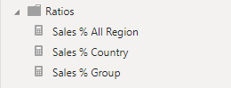

---
lab:
    title: 'Create Advanced DAX Calculations in Power BI Desktop'
    module: 'Create Model Calculations using DAX in Power BI'
---


# Create Advanced DAX Calculations in Power BI Desktop

## **Lab story**

Trong phòng thí nghiệm này, bạn sẽ tạo các thước đo với biểu thức DAX liên quan đến thao tác ngữ cảnh bộ lọc.

Trong phòng thí nghiệm này, bạn học cách:

- Sử dụng hàm CALCULATE() để thao tác với ngữ cảnh bộ lọc
- Sử dụng chức năng Time Intelligence

**Phòng thí nghiệm này sẽ mất khoảng 45 phút.**

## **Work with Filter Context**

*Quan trọng: Nếu bạn đang tiếp tục từ phòng thí nghiệm trước (và bạn đã hoàn thành bài thí nghiệm đó thành công), thì đừng hoàn thành nhiệm vụ này; thay vào đó, hãy tiếp tục từ nhiệm vụ tiếp theo.*

1. Open Power BI Desktop.

    

    *Tip: By default, the Getting Started dialog box opens in front of Power BI Desktop. You can choose to sign-in, and then close the pop-up.*

1. To open the starter Power BI Desktop file, select the **File > Open Report > Browse Reports**.

1. In the **Open** window, navigate to the **D:\PL300\Labs\05-create-dax-calculations-in-power-bi-desktop-advanced\Starter**  folder, and open the **Sales Analysis** file.

1. Close any informational windows that may open.

1. Notice the yellow warning message beneath the ribbon. 

	*This message alerts you to the fact that the queries haven't been applied to load as model tables. You’ll apply the queries later in this lab.*
    
	*To dismiss the warning message, at the right of the yellow warning message, select **X**.*

1. To create a copy of the file, go to **File > Save As** and save to **D:\PL300\MySolution** folder.

## **Create a matrix visual**

In this task, you'll create a matrix visual to support testing your new measures.
Trong nhiệm vụ này, bạn sẽ tạo một hình ảnh ma trận để hỗ trợ thử nghiệm các biện pháp mới của mình.

1. In Power BI Desktop, in Report view, create a new report page.
   Trong Power BI Desktop, ở dạng xem Báo cáo, hãy tạo một trang báo cáo mới.

1. On **Page 3**, add a matrix visual.

    

1. Resize the matrix visual to fill the entire page.
   Thay đổi kích thước hình ảnh ma trận để lấp đầy toàn bộ trang.

1. To configure the matrix visual fields, from the **Data** pane, drag the **Region \| Regions** hierarchy, and drop it inside the visual.

    Để định cấu hình các trường trực quan ma trận, từ ngăn **Data**, hãy kéo **Region \| Regions** và thả nó vào bên trong hình ảnh.
    
	*The labs use a shorthand notation to reference a field or hierarchy. It will look like this: **Region \| Regions**. In this example, **Region** is the table name and **Regions** is the hierarchy name.*

    * Các phòng thí nghiệm sử dụng ký hiệu tốc ký để tham chiếu một trường hoặc cấu trúc phân cấp. Nó sẽ trông như thế này: **Region \| Regions**. Trong ví dụ này, **Region** là tên bảng và **Regions** là tên phân cấp.*

1. Add also the **Sales \| Sales** field.
   Thêm cả **Sales \| Sales**.

1. To expand the entire hierarchy, at the top-right of the matrix visual, select the forked-double arrow icon twice.

   Để mở rộng toàn bộ cấu trúc phân cấp, ở trên cùng bên phải của hình ảnh ma trận, hãy chọn biểu tượng mũi tên chia đôi hai lần.
    
	*You may recall that the **Regions** hierarchy has the levels **Group**, **Country**, and **Region**.*

    *Bạn có thể nhớ rằng hệ thống phân cấp **Khu vực** có các cấp **Nhóm**, **Quốc gia** và **Khu vực**.*

    

1. To format the visual, in the **Visualizations** pane, select the **Format** pane.
Để định dạng hình ảnh, trong ngăn **Visualizations**, hãy chọn ngăn **Format**.

    

1. In the **Search** box, enter **Stepped**.
Trong hộp **Search**, hãy nhập **Stepped**.

1. Set the **Stepped Layout** property to **Off**.
Đặt thuộc tính **Stepped Layout** thành **Off**.

    

1. Verify that the matrix visual now has four column headers.
Xác minh rằng hình ảnh ma trận hiện có bốn tiêu đề cột.

    

    *At Adventure Works, the sales regions are organized into groups, countries, and regions. All countries—except the United States—have just one region, which is named after the country. As the United States is such a large sales territory, it’s divided into five sales regions.*

    *You’ll create several measures in this exercise, and then test them by adding them to the matrix visual.*

    *Tại Adventure Works, các khu vực bán hàng được tổ chức thành các nhóm, quốc gia và khu vực. Tất cả các quốc gia—ngoại trừ Hoa Kỳ—chỉ có một vùng được đặt tên theo quốc gia. Vì Hoa Kỳ là một lãnh thổ bán hàng rộng lớn nên Hoa Kỳ được chia thành năm khu vực bán hàng.*

    *Bạn sẽ tạo một số thước đo trong bài tập này, sau đó kiểm tra chúng bằng cách thêm chúng vào hình ảnh ma trận.*

## **Manipulate filter context**

In this task, you'll create several measures with DAX expressions that use the CALCULATE() function to manipulate filter context.

Trong nhiệm vụ này, bạn sẽ tạo một số thước đo với các biểu thức DAX sử dụng hàm CALCULATE() để thao tác ngữ cảnh bộ lọc.

1. Add a measure to the **Sales** table, based on the following expression:
Thêm thước đo vào bảng **Sales**, dựa trên biểu thức sau:
    
	 *For your convenience, all DAX definitions in this lab can be copied from the **D:\PL300\Labs\05-create-dax-calculations-in-power-bi-desktop-advanced\Assets\Snippets.txt** file.*


    **DAX**


    ```
    Sales All Region =

    CALCULATE(SUM(Sales[Sales]), REMOVEFILTERS(Region))
    ```


    *The CALCULATE() function is a powerful function used to manipulate the filter context. The first argument takes an expression or a measure (a measure is just a named expression). Subsequent arguments allow modifying the filter context.*

    *The REMOVEFILTERS() function removes active filters. It can take either no arguments, or a table, a column, or multiple columns as its argument.*

    *In this formula, the measure evaluates the sum of the **Sales** column in a modified filter context, which removes any filters applied to the columns of the **Region** table.*

    * Hàm CALCULATE() là một hàm mạnh mẽ được sử dụng để thao tác bối cảnh bộ lọc. Đối số đầu tiên nhận một biểu thức hoặc một thước đo (một thước đo chỉ là một biểu thức được đặt tên). Các đối số tiếp theo cho phép sửa đổi ngữ cảnh bộ lọc.*

    *Hàm REMOVEFILTERS() loại bỏ các bộ lọc đang hoạt động. Nó có thể không có đối số hoặc một bảng, một cột hoặc nhiều cột làm đối số.*

    *Trong công thức này, thước đo đánh giá tổng của cột **Sales** trong ngữ cảnh bộ lọc đã sửa đổi, loại bỏ mọi bộ lọc được áp dụng cho các cột của bảng **Region**.*

1. Add the **Sales All Region** measure to the matrix visual.
Thêm thước đo **Sales All Region** vào hình ảnh ma trận.

    

1. Notice that the **Sales All Region** measure computes the total of all region sales for each region, country (subtotal) and group (subtotal).

Lưu ý rằng thước đo **Sales All Region** tính tổng doanh số bán hàng của tất cả các khu vực cho từng khu vực, quốc gia (subtotal) và nhóm (subtotal).

    *The new measure is yet to deliver a useful result. When the sales for a group, country, or region is divided by this value it will produce a useful ratio known as “percent of grand total”.*

    * Biện pháp mới vẫn chưa mang lại kết quả hữu ích. Khi doanh số bán hàng của một nhóm, quốc gia hoặc khu vực được chia cho giá trị này, nó sẽ tạo ra một tỷ lệ hữu ích được gọi là “percent of grand total”.*

1. In the **Data** pane, ensure that the **Sales All Region** measure is selected (when selected, it will have a dark gray background), and then in the formula bar, replace the measure name and formula with the following formula:

Trong ngăn **Data**, hãy đảm bảo rằng thước đo **Sales All Region** được chọn (khi được chọn, nó sẽ có nền màu xám đậm), sau đó trong thanh công thức, hãy thay thế tên và công thức của thước đo bằng công thức sau:

    *Tip: To replace the existing formula, first copy the snippet. Then, select inside the formula bar and press **Ctrl+A** to select all text. Then, press **Ctrl+V** to paste the snippet to overwrite the selected text. Then press **Enter**.*

    *Mẹo: Để thay thế công thức hiện có, trước tiên hãy sao chép đoạn mã. Sau đó, chọn bên trong thanh công thức và nhấn **Ctrl+A** để chọn tất cả văn bản. Sau đó, nhấn **Ctrl+V** để dán đoạn mã nhằm ghi đè lên văn bản đã chọn. Sau đó nhấn **Enter**.*


    **DAX**


    ```
    Sales % All Region =  
    DIVIDE(  
     SUM(Sales[Sales]),  
     CALCULATE(  
     SUM(Sales[Sales]),  
     REMOVEFILTERS(Region)  
     )  
    )
    ```

    *The measure has been renamed to accurately reflect the updated formula. The DIVIDE() function divides the **Sales** measure (not modified by filter context) by the **Sales** measure in a modified context, which removes any filters applied to the **Region** table.*

    *Thước đo đã được đổi tên để phản ánh chính xác công thức được cập nhật. Hàm DIVIDE() chia thước đo **Sales** (không được sửa đổi theo ngữ cảnh bộ lọc) cho thước đo **Sales** trong ngữ cảnh đã sửa đổi, thao tác này sẽ xóa mọi bộ lọc được áp dụng cho bảng **Region**.*

1. In the matrix visual, notice that the measure has been renamed and that a different value now appears for each group, country, and region.
Trong hình ảnh ma trận, hãy lưu ý rằng thước đo đã được đổi tên và giá trị khác hiện xuất hiện cho từng nhóm, quốc gia và khu vực.


1. Format the **Sales % All Region** measure as a percentage with two decimal places.
Định dạng phép đo **Sales % All Region** dưới dạng phần trăm với hai chữ số thập phân

1. In the matrix visual, review the **Sales % All Region** measure values.
Trong hình ảnh ma trận, hãy xem lại các giá trị đo lường **Sales % All Region**.

    

1. Add another measure to the **Sales** table, based on the following expression, and format as a percentage:

Thêm thước đo khác vào bảng **Sales**, dựa trên biểu thức sau và định dạng dưới dạng phần trăm:

    **DAX**

    ```
    Sales % Country =  
    DIVIDE(  
     SUM(Sales[Sales]),  
     CALCULATE(  
     SUM(Sales[Sales]),  
     REMOVEFILTERS(Region[Region])  
     )  
    )
    ```

1. Notice that the **Sales % Country** measure formula differs slightly from the **Sales % All Region** measure formula.
Lưu ý rằng công thức đo lường **Sales % Country** hơi khác so với công thức đo lường **Sales % All Region**.

    *The difference is that the denominator modifies the filter context by removing filters on the **Region** column of the **Region** table, not all columns of the **Region** table. It means that any filters applied to the group or country columns are preserved. It will achieve a result that represents the sales as a percentage of country.*

    *Sự khác biệt là mẫu số sửa đổi ngữ cảnh bộ lọc bằng cách xóa các bộ lọc trên cột **Region** của bảng **Region**, chứ không phải tất cả các cột của bảng **Region**. Điều đó có nghĩa là bất kỳ bộ lọc nào được áp dụng cho các cột nhóm hoặc quốc gia đều được giữ nguyên. Nó sẽ đạt được kết quả thể hiện doanh số bán hàng theo tỷ lệ phần trăm của quốc gia.*

1. Add the **Sales % Country** measure to the matrix visual.
Thêm thước đo **Sales % Country** vào hình ảnh ma trận

1. Notice that only the United States’ regions produce a value that isn't 100%.
Lưu ý rằng chỉ các khu vực của Hoa Kỳ mới tạo ra giá trị không phải là 100%.
    
	*You may recall that only the United States has multiple regions. All other countries comprise a single region, which explains why they're all 100%.*

    *Bạn có thể nhớ lại rằng chỉ có Hoa Kỳ có nhiều vùng. Tất cả các quốc gia khác bao gồm một khu vực duy nhất, điều này giải thích tại sao tất cả các quốc gia đó đều là 100%.*

    

    

1. To improve the readability of this measure in visual, overwrite the **Sales % Country** measure with this improved formula.
Để cải thiện khả năng đọc của thước đo này bằng hình ảnh, hãy ghi đè thước đo **Sales % Country** bằng công thức cải tiến này.

    **DAX**


    ```
    Sales % Country =  
    IF(  
     ISINSCOPE(Region[Region]),  
     DIVIDE(  
     SUM(Sales[Sales]),  
     CALCULATE(  
     SUM(Sales[Sales]),  
     REMOVEFILTERS(Region[Region])  
     )  
     )  
    )
    ```


    *The IF() function uses the ISINSCOPE() function to test whether the region column is the level in a hierarchy of levels. When true, the DIVIDE() function is evaluated. When false, a blank value is returned because the region column isn't in scope.*

    *Hàm IF() sử dụng hàm ISINSCOPE() để kiểm tra xem cột khu vực có phải là cấp trong hệ thống phân cấp các cấp hay không. Khi đúng, hàm DIVIDE() được đánh giá. Khi sai, một giá trị trống được trả về vì cột khu vực không nằm trong phạm vi.*

1. Notice that the **Sales % Country** measure now only returns a value when a region is in scope.
Lưu ý rằng thước đo **Sales % Country** hiện chỉ trả về giá trị khi một khu vực nằm trong phạm vi.

    

1. Add another measure to the **Sales** table, based on the following expression, and format as a percentage:
Thêm thước đo khác vào bảng **Sales**, dựa trên biểu thức sau và định dạng dưới dạng phần trăm:

    **DAX**


    ```
    Sales % Group =  
    DIVIDE(  
     SUM(Sales[Sales]),  
     CALCULATE(  
     SUM(Sales[Sales]),  
     REMOVEFILTERS(  
     Region[Region],  
     Region[Country]  
     )  
     )  
    )
    ```


    *To achieve sales as a percentage of group, two filters can be applied to effectively remove the filters on two columns.*

    *Để đạt được doanh số theo tỷ lệ phần trăm của nhóm, có thể áp dụng hai bộ lọc để loại bỏ hiệu quả các bộ lọc trên hai cột.*

1. Add the **Sales % Group** measure to the matrix visual.
Thêm thước đo **Sales % Group** vào hình ảnh ma trận.

1. To improve the readability of this measure in visual, overwrite the **Sales % Group** measure with this improved formula.
Để cải thiện khả năng đọc thước đo này bằng hình ảnh, hãy ghi đè thước đo **Sales % Group** bằng công thức cải tiến này.


    **DAX**


    ```
    Sales % Group =  
    IF(  
     ISINSCOPE(Region[Region])  
     || ISINSCOPE(Region[Country]),  
     DIVIDE(  
     SUM(Sales[Sales]),  
     CALCULATE(  
     SUM(Sales[Sales]),  
     REMOVEFILTERS(  
     Region[Region],  
     Region[Country]  
     )  
     )  
     )  
    )
    ```


1. Notice that the **Sales % Group** measure now only returns a value when a region or country is in scope.

Lưu ý rằng thước đo **Sales % Group** hiện chỉ trả về giá trị khi một khu vực hoặc quốc gia nằm trong phạm vi.

1. In Model view, place the three new measures into a display folder named **Ratios**.
Trong chế độ xem Mô hình, hãy đặt ba thước đo mới vào thư mục hiển thị có tên **Ratios**.

    

1. Save the Power BI Desktop file.
Lưu tệp Power BI Desktop

*The measures added to the **Sales** table have modified filter context to achieve hierarchical navigation. Notice that the pattern to achieve the calculation of a subtotal requires removing some columns from the filter context, and to arrive at a grand total, all columns must be removed.*

*Các biện pháp được thêm vào bảng **Sales** đã sửa đổi ngữ cảnh bộ lọc để đạt được điều hướng theo thứ bậc. Lưu ý rằng mẫu để đạt được phép tính tổng phụ yêu cầu xóa một số cột khỏi ngữ cảnh bộ lọc và để đạt được tổng cộng, tất cả các cột phải được xóa.*

## **Work with Time Intelligence**

In this exercise, you'll create a sales year-to-date (YTD) measure and sales year-over-year (YoY) growth measure.

Trong bài tập này, bạn sẽ tạo thước đo doanh số bán hàng từ đầu năm đến nay (YTD) và thước đo tăng trưởng doanh số hàng năm (YoY).

## **Create a YTD measure**

In this task, you'll create a sales YTD measure.
Trong nhiệm vụ này, bạn sẽ tạo thước đo bán hàng YTD.

1. In Report view, on **Page 2**, notice the matrix visual that displays various measures with years and months grouped on the rows.
Trong chế độ xem Báo cáo, trên **Page 2**, hãy lưu ý hình ảnh ma trận hiển thị các thước đo khác nhau với năm và tháng được nhóm trên các hàng.

2. Add a measure to the **Sales** table, based on the following expression, and formatted to zero decimal places:
Thêm thước đo vào bảng **Sales**, dựa trên biểu thức sau và được định dạng thành 0 chữ số thập phân:

    **DAX**
    ```
    Sales YTD =  
    TOTALYTD(SUM(Sales[Sales]), 'Date'[Date], "6-30")
    ```


    *The TOTALYTD() function evaluates an expression—in this case the sum of the **Sales** column—over a given date column. The date column must belong to a date table marked as a date table, as was done in the **Create DAX Calculations in Power BI Desktop** lab.*

    *The function can also take a third optional argument representing the last date of a year. The absence of this date means that December 31 is the last date of the year. For Adventure Works, June in the last month of their year, and so “6-30” is used.*

    *Hàm TOTALYTD() đánh giá một biểu thức—trong trường hợp này là tổng của cột **Sales**—trong một cột ngày nhất định. Cột ngày phải thuộc về một bảng ngày được đánh dấu là bảng ngày, như đã được thực hiện trong phòng thí nghiệm **Create DAX Calculations in Power BI Desktop**.*

    *Hàm này cũng có thể nhận một đối số tùy chọn thứ ba biểu thị ngày cuối cùng của một năm. Sự vắng mặt của ngày này có nghĩa là ngày 31 tháng 12 là ngày cuối cùng của năm. Đối với Adventure Works, tháng 6 trong tháng cuối cùng của năm và do đó, “6-30” được sử dụng.*

3. Add the **Sales** field and the **Sales YTD** measure to the matrix visual.
Thêm trường **Sales** và thước đo **Sales YTD** vào hình ảnh ma trận.

4. Notice the accumulation of sales values within the year.
Lưu ý sự tích lũy giá trị bán hàng trong năm.

    

    *The TOTALYTD() function performs filter manipulation, specifically time filter manipulation. For example, to compute YTD sales for September 2017 (the third month of the fiscal year), all filters on the **Date** table are removed and replaced with a new filter of dates commencing at the beginning of the year (July 1, 2017) and extending through to the last date of the in-context date period (September 30, 2017).*

    *Many Time Intelligence functions are available in DAX to support common time filter manipulations.*

    *Hàm TOTALYTD() thực hiện thao tác với bộ lọc, cụ thể là thao tác với bộ lọc thời gian. Ví dụ: để tính doanh số YTD cho tháng 9 năm 2017 (tháng thứ ba của năm tài chính), tất cả bộ lọc trên bảng **Ngày** sẽ bị xóa và thay thế bằng bộ lọc mới gồm các ngày bắt đầu vào đầu năm (ngày 1 tháng 7 , 2017) và kéo dài đến ngày cuối cùng của khoảng thời gian ngày trong ngữ cảnh (ngày 30 tháng 9 năm 2017).*

    *Nhiều chức năng Thời gian thông minh có sẵn trong DAX để hỗ trợ các thao tác bộ lọc thời gian phổ biến.*

## **Create a YoY growth measure**

In this task, you'll create a sales YoY growth measure.
Trong nhiệm vụ này, bạn sẽ tạo thước đo tăng trưởng doanh số hàng năm.

1. Add another measure to the **Sales** table, based on the following expression:
Thêm một thước đo khác vào bảng **Sales**, dựa trên biểu thức sau:

    **DAX**


    ```
    Sales YoY Growth =  
    VAR SalesPriorYear =  
     CALCULATE(  
     SUM(Sales[Sales]),  
     PARALLELPERIOD(  
     'Date'[Date],  
     -12,  
     MONTH  
     )  
     )  
    RETURN  
     SalesPriorYear
    ```


    *The **Sales YoY Growth** measure uses a variable. Variables help you simplify the formula and are more efficient if using the logic multiple times within a formula.*

    *Variables are declared with a unique name, and the measure expression must then be output after the **RETURN** keyword. Unlike some other coding language variables, DAX variables can only be used within the single formula.*

    *The **SalesPriorYear** variable is assigned an expression that calculates the sum of the **Sales** column in a modified context that uses the PARALLELPERIOD() function to shift 12 months back from each date in filter context.*

    *Đo lường **Sales YoY Growth** sử dụng một biến số. Biến giúp bạn đơn giản hóa công thức và hiệu quả hơn nếu sử dụng logic nhiều lần trong một công thức.*

    *Các biến được khai báo với một tên duy nhất và khi đó biểu thức thước đo phải được xuất ra sau từ khóa **RETURN**. Không giống như một số biến ngôn ngữ lập trình khác, biến DAX chỉ có thể được sử dụng trong một công thức duy nhất.*

    *Biến **SalesPriorYear** được gán một biểu thức tính tổng của cột **Sales** trong ngữ cảnh đã sửa đổi sử dụng hàm PARALLELPERIOD() để lùi 12 tháng kể từ mỗi ngày trong ngữ cảnh bộ lọc.*

1. Add the **Sales YoY Growth** measure to the matrix visual.

1. Notice that the new measure returns BLANK for the first 12 months (because there were no sales recorded before fiscal year 2017).

Lưu ý rằng biện pháp mới trả về TRỐNG trong 12 tháng đầu tiên (vì không có doanh số bán hàng nào được ghi nhận trước năm tài chính 2017).

1. Notice that the **Sales YoY Growth** measure value for **2018 Jul** is the **Sales** value for **2017 Jul**.

Lưu ý rằng giá trị đo lường **Sales YoY Growth** cho **2018 Jul** là giá trị **Sales** cho **2017 Jul**.

    

    *Now that the “difficult part” of the formula has been tested, you can overwrite the measure with the final formula that computes the growth result.*

    *Giờ đây, “difficult part” của công thức đã được kiểm tra, bạn có thể ghi đè thước đo bằng công thức cuối cùng để tính kết quả tăng trưởng.*

1. To complete the measure, overwrite the **Sales YoY Growth** measure with this formula, formatting it as a percentage with two decimal places:
Để hoàn thành thước đo, hãy ghi đè thước đo **Sales YoY Growth** bằng công thức này, định dạng nó dưới dạng phần trăm với hai chữ số thập phân:


    **DAX**


    ```
    Sales YoY Growth =  
    VAR SalesPriorYear =  
     CALCULATE(  
     SUM(Sales[Sales]),  
     PARALLELPERIOD(  
     'Date'[Date],  
     -12,  
     MONTH  
     )  
     )  
    RETURN  
     DIVIDE(  
     (SUM(Sales[Sales]) - SalesPriorYear),  
     SalesPriorYear  
     )
    ```


1. In the formula, in the **RETURN** clause, notice that the variable is referenced twice.
Trong công thức, ở mệnh đề **RETURN**, hãy lưu ý rằng biến được tham chiếu hai lần(SalesPriorYear).

1. Verify that the YoY growth for **2018 Jul** is **392.83%**.
Xác minh rằng mức tăng trưởng hàng năm cho **tháng 7 năm 2018** là **392,83%**.

    

    *The YoY growth measure identifies almost 400% (or 4x) increase of sales during the same period of the previous year.*

    *Thước đo tăng trưởng hàng năm xác định doanh số bán hàng tăng gần 400% (hoặc gấp 4 lần) trong cùng kỳ năm trước.*

1. In Model view, place the two new measures into a display folder named **Time Intelligence**.
Trong chế độ xem Mô hình, đặt hai thước đo mới vào thư mục hiển thị có tên **Time Intelligence**.

    

### **Finish up**

In this task, you'll complete the lab.

1. To clean up the solution ready for report development, at the bottom-left, right-click the **Page 2** tab, and then select **Delete** page. When prompted to delete the page, select **Delete**.

1. Delete **Page 3** also.

1. On the remaining page, to clear the page, select the table visual, and the press the **Delete** key.

1. Save the Power BI Desktop file.

1. If you intend to start the next lab, leave Power BI Desktop open.

*You’ll create a report based on the data model in the **Design a Report in Power BI Desktop** lab.*

Trong nhiệm vụ này, bạn sẽ hoàn thành phòng thí nghiệm.

Để làm sạch giải pháp sẵn sàng cho việc phát triển báo cáo, ở dưới cùng bên trái, bấm chuột phải vào tab Trang 2 rồi chọn Xóa trang. Khi được nhắc xóa trang, hãy chọn Xóa.

Xóa Trang 3 cũng được.

Trên trang còn lại, để xóa trang, hãy chọn hình ảnh bảng và nhấn phím Delete.

Lưu tệp Power BI Desktop.

Nếu bạn định bắt đầu phòng thí nghiệm tiếp theo, hãy để Power BI Desktop mở.

Bạn sẽ tạo một báo cáo dựa trên mô hình dữ liệu trong phòng thí nghiệm Thiết kế báo cáo trong Power BI Desktop.