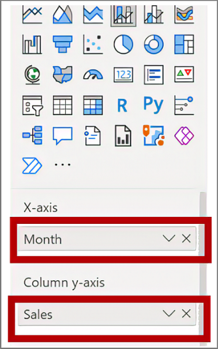
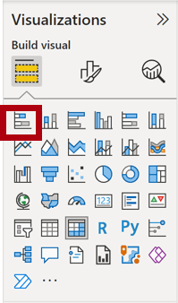
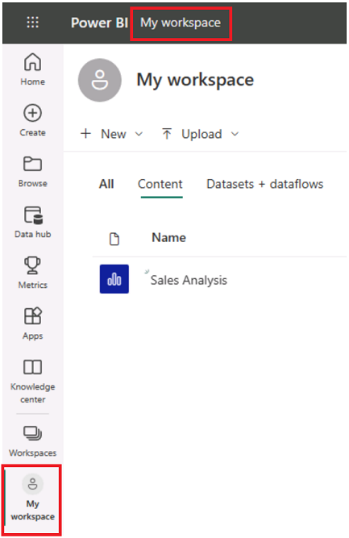

---
lab:
    title: 'Design a Report in Power BI Desktop'
    module: 'Create Reports in Power BI Desktop'
---

# Design a Report in Power BI Desktop

## **Lab story**

In this lab, you'll create a three-page report. You'll then publish it to Power BI, where you'll open and interact with the report.

In this lab you learn how to:

- Design a report
- Configure visual fields and format properties

**This lab should take approximately 45 minutes.**

Trong phòng thí nghiệm này, bạn sẽ tạo một báo cáo dài ba trang. Sau đó, bạn sẽ xuất bản nó lên Power BI, nơi bạn sẽ mở và tương tác với báo cáo.

Trong phòng thí nghiệm này, bạn học cách:

- Thiết kế báo cáo
- Định cấu hình các trường trực quan và thuộc tính định dạng

**Phòng thí nghiệm này sẽ mất khoảng 45 phút.**

## **Create a Report**

In this task, you'll set up the environment for the lab by opening the starter report.

Trong nhiệm vụ này, bạn sẽ thiết lập môi trường cho phòng thí nghiệm bằng cách mở báo cáo ban đầu.

1. From Power BI Desktop, navigate to **File** > **Open report** > **Browse Reports**.

1. Open the **Sales Analysis** file in the  **D:\PL300\Labs\06-design-report-in-power-bi-desktop\Starter** folder.

1. Create a copy of the file by going to **File** > **Save As**, and save the copy in the **D:\PL300\MySolution** folder.

## **Design page 1**

In this task, you'll design the first report page. When you’ve completed the design, the page will look like the following:

Trong nhiệm vụ này, bạn sẽ thiết kế trang báo cáo đầu tiên. Khi bạn đã hoàn thành thiết kế, trang sẽ trông giống như sau:

1. In Power BI Desktop, to rename the page, at the bottom-left, right-click **Page 1**, then **Rename** the page as **Overview**.
Trong Power BI Desktop, để đổi tên trang, ở dưới cùng bên trái, nhấp chuột phải vào **Page 1**, sau đó **Rename** trang thành **Overview**.

    *Tip: You can also double-click the page name to rename it.*
    *Mẹo: Bạn cũng có thể nhấp đúp vào tên trang để đổi tên.*

1. To add an image, on the **Insert** ribbon tab, from inside the **Elements** group, select **Image**.
Để thêm hình ảnh, trên tab dải băng **Insert**, từ bên trong nhóm **Elements**, chọn **Image**.

    

1. In the **Open** window, navigate to the **D:\PL300\Resources** folder.
Trong cửa sổ **Open**, điều hướng đến thư mục **D:\PL300\Resources**.

1. Select the **AdventureWorksLogo.jpg** file, and then select **Open**.
Chọn tệp **AdventureWorksLogo.jpg** rồi chọn **Open**.

1. Drag the image to position it at the top-left corner, and also drag the guide markers to resize it.
Kéo hình ảnh để định vị nó ở góc trên cùng bên trái, đồng thời kéo các điểm đánh dấu hướng dẫn để thay đổi kích thước hình ảnh.

     

1. To add a slicer, first de-select the image by clicking an empty area of the report page, then select the **Slicer** in the **Visualizations** pane.
Để thêm bộ cắt, trước tiên hãy bỏ chọn hình ảnh bằng cách nhấp vào vùng trống của trang báo cáo, sau đó chọn **Slicer** trong ngăn **Visualizations**.

     

1. In the **Data** pane, drag the **Date \| Year** field (not the **Year** level of the hierarchy) into the slicer **Field** in Visualizations pane.
Trong ngăn **Data**, hãy kéo **Date \| Year** (không phải cấp **Year** của cấu trúc phân cấp) vào slicer **Field** trong ngăn Trực quan hóa.
    
	*The labs use a shorthand notation to reference a field. It will look like this: **Date \| Year**. In this example, **Date** is the table name and **Year** is the field name.*

     * Các phòng thí nghiệm sử dụng ký hiệu tốc ký để tham chiếu một trường. Nó sẽ trông như thế này: **Date \| Year**. Trong ví dụ này, **Date** là tên bảng và **Year** là tên trường.*

1. To convert the slicer from a list to a dropdown, navigate to **Visualizations > Format visual > Visual > Slicer Settings > Style**, and then select **Dropdown** from the dropdown menu.
Để chuyển đổi bộ cắt từ danh sách thành danh sách thả xuống, hãy điều hướng đến **Visualizations > Format visual > Visual > Slicer Settings > Style**, sau đó chọn **Dropdown** từ menu thả xuống.

    

1. Resize and position the slicer so it sits beneath the image and is the same width as the image.
Thay đổi kích thước và định vị bộ cắt để nó nằm bên dưới hình ảnh và có cùng chiều rộng với hình ảnh.

     

1. In the **Year** slicer, open the dropdown list, select **FY2020**, and then collapse the dropdown list.
    1. *The report page is now filtered by year **FY2020**.*
    *Trang báo cáo hiện được lọc theo năm **FY2020**.*

     

1. De-select the slicer by clicking an empty area of the report page.
Bỏ chọn bộ cắt bằng cách nhấp vào vùng trống của trang báo cáo.

1. Create a second slicer, based on the **Region \| Region** field (not the **Region** level of the hierarch).
Tạo một slicer thứ hai, dựa trên **Region \| Region** (không phải cấp **Region** của hệ thống phân cấp).

1. Leave the slicer as a list, and then resize and position the slicer beneath the **Year** slicer.
Để bộ cắt dưới dạng danh sách, sau đó thay đổi kích thước và định vị bộ cắt bên dưới bộ cắt **Năm**.

     

1. De-select the slicer by clicking an empty area of the report page.
Bỏ chọn bộ cắt bằng cách nhấp vào vùng trống của trang báo cáo.

1. To add a chart to the page, in the **Visualizations** pane, select the **Line and Stacked Column Chart** visual type.
Để thêm biểu đồ vào trang, trong ngăn **Visualizations**, hãy chọn loại hình ảnh **Line and Stacked Column Chart**.

     

1. Resize and position the visual so it sits to the right of the logo, and so it fills the width of the report page.
Thay đổi kích thước và định vị hình ảnh sao cho hình ảnh nằm ở bên phải biểu trưng và do đó hình ảnh sẽ lấp đầy chiều rộng của trang báo cáo.

     

1. Drag and drop the following fields into the visual:
Kéo và thả các trường sau vào hình ảnh:

     - Date \| Month
     - Sales \| Sales

1. In the visual fields pane (located beneath the **Visualizations** pane), notice that the fields are assigned to the **X-axis** and **Column y-axis** wells/areas.
Trong ngăn trường trực quan (nằm bên dưới ngăn **Visualizations**), lưu ý rằng các trường được gán cho các giếng/khu vực **Trục X** và **Trục y**.
    
	*By dragging fields into a visual, they'll be added to default wells/areas. For precision, you can drag fields directly into the wells/areas, as you'll do next.*

     *Bằng cách kéo các trường vào hình ảnh, chúng sẽ được thêm vào các giếng/khu vực mặc định. Để có độ chính xác, bạn có thể kéo các trường trực tiếp vào các giếng/khu vực, như bạn sẽ làm tiếp theo.*

     

1. From the **Data** pane, drag the **Sales \| Profit Margin** field into the **Line y-axis** well/area.
Từ ngăn **Data**, hãy kéo **Sales \| Profit Margin** vào giếng/khu vực **Line y-axis **.

     

1. Notice that the visual has 11 months only.
Lưu ý rằng hình ảnh chỉ có 11 tháng.
    
	*The last month of the year, 2020 June, doesn't have any sales (yet). By default, the visual has eliminated months with BLANK sales. You'll now configure the visual to show all months.*

     *Tháng cuối cùng của năm, tháng 6 năm 2020, không có bất kỳ doanh số nào (chưa). Theo mặc định, hình ảnh đã loại bỏ các tháng có doanh số TRỐNG. Bây giờ, bạn sẽ định cấu hình hình ảnh để hiển thị tất cả các tháng.*

1. In the visual fields pane, in the **X-axis** well/area, for the **Month** field, select the down-arrow, and then select **Show Items With No Data**.

Trong ngăn trường trực quan, trong ô/khu vực **X-axis**, đối với trường **Month**, hãy chọn mũi tên xuống, sau đó chọn **Show Items With No Data**.
    
	*Notice that the month **2020 June** now appears.*
     *Lưu ý rằng tháng **tháng 6 năm 2020** hiện đã xuất hiện.*

     

1. De-select the chart by clicking an empty area of the report page.
Bỏ chọn biểu đồ bằng cách nhấp vào vùng trống của trang báo cáo.

1. To add a chart to the page, in the **Visualizations** pane, select the **Stacked Column Chart** visual type.
Để thêm biểu đồ vào trang, trong ngăn **Hình ảnh hóa**, hãy chọn loại hình ảnh **Biểu đồ cột xếp chồng**.

     

1. Resize and position the visual so it sits beneath the column/line chart, and so it fills half the width of the chart above.
Định cỡ lại và định vị hình ảnh sao cho hình ảnh nằm bên dưới biểu đồ cột/đường và do đó, hình ảnh sẽ lấp đầy một nửa chiều rộng của biểu đồ bên trên.

     

1. Add the following fields to the visual wells/areas:
Thêm các trường sau vào giếng/khu vực trực quan:

     - X-axis: **Region \| Country**
     - Y-axis: **Sales \| Sales**
     - Legend: **Product \| Category**

1. De-select the chart by clicking an empty area of the report page.
Bỏ chọn biểu đồ bằng cách nhấp vào vùng trống của trang báo cáo.

1. To add a chart to the page, in the **Visualizations** pane, click the **Stacked Bar Chart** visual type.
Để thêm biểu đồ vào trang, trong ngăn **Visualizations**, nhấp vào loại hình ảnh **Stacked Bar Chart**.

     

1. Resize and position the visual so it fills the remaining report page space.
Resize and position the visual so it fills the remaining report page space.

     

1. Add the following fields to the visual wells/areas:
Thêm các trường sau vào giếng/khu vực trực quan:

     - Y-axis: **Product \| Category**
     - X-axis: **Sales \| Quantity**

1. To format the visual, open the **Format** pane.
Để định dạng hình ảnh, hãy mở ngăn **Format**.

     

1. Expand the **Bars** and then the **Colors** group, and then set the **Default Color** property to a suitable color (to complement the column/line chart).

Mở rộng nhóm **Bars** và sau đó là nhóm **Colors**, sau đó đặt thuộc tính **Default Color** thành một màu phù hợp (để bổ sung cho biểu đồ cột/đường).

1. Set the **Data Labels** property to **On**.

     

1. Save the Power BI Desktop file.

*The design of the first page is now complete.*

## **Design page 2**

In this task, you'll design the second report page. When you’ve completed the design, the page will look like the following:

 

*Important: When detailed instructions have already been provided in the labs, the lab steps will provide more concise instructions. If you need the detailed instructions, you can refer back to other tasks in this lab.*

1. To create a new page, at the bottom-left, select the plus icon, and rename new page to **Profit**.

1. Add a slicer based on the **Region \| Region** field.

1. Use the **Format** pane to enable the “Select All” option (in the **Selection** group).

1. Resize and position the slicer so it sits at the left side of the report page, and so it is about half the page height.

     

1. Add a matrix visual, and resize and position it so it fills the remaining space of the report page

     

1. Add the **Date \| Fiscal** hierarchy to the matrix **Rows** well/area.

     

1. Add the following five **Sales** table fields to the **Values** well/area:

     - Orders (from the **Counts** folder)
     - Sales
     - Cost
     - Profit
     - Profit Margin

     

1. In the **Filters** pane (located at the left of the **Visualizations** pane), notice the **Filter On This Page** well/area (you may need to scroll down).

     

1. From the **Data** pane, drag the **Product \| Category** field into the **Filter On This Page** well/area.
    
	*Fields added to the **Filters** pane can achieve the same result as a slicer. One difference is they don’t take up space on the report page. Another difference is that they can be configured to achieve more sophisticated filtering requirements.*

1. Inside the filter card, at the top-right, select the arrow to collapse the card.

1. Add each of the following **Product** table fields to the **Filter On This Page** well/area, collapsing each, directly beneath the **Category** card:

     - Subcategory
     - Product
     - Color

     

1. Save the Power BI Desktop file.

 *The design of the second page is now complete.*

## **Design page 3**

In this task, you'll design the third—and final—report page. When you’ve completed the design, the page will look like the following:

 

1. Create a new page, and then rename it as **My Performance**.

1. To simulate the performance of row-level security filters, drag the **Salesperson (Performance) \| Salesperson** field to the page level filters in the filter pane.

     

1. Select **Michael Blythe**. Data on the **My Performance** report page will now be filtered to display data for Michael Blythe only.

1. Add a dropdown slicer based on the **Date \| Year** field, and then resize and position it so it sits at the top-left corner of the page.

     

1. In the slicer, set the page to filter by **FY2019**.

     

1. Add a **Multi-row Card** visual, and then resize and reposition it so it sits to the right of the slicer and fills the remaining width of the page.

     

     

1. Add the following four fields to the visual:

     - Sales \| Sales
     - Targets \| Target
     - Targets \| Variance
     - Targets \| Variance Margin

1. Format the visual:

     - In the **Callout values** group, increase the **Text Size** property to **28pt**

     - In the **General > Effects > Background** group, set the **Color** to a light gray color (such as "White, 20% Darker) to give contrast

         

1. Add a **Clustered Bar Chart** visual, and then resize and position it so it sits beneath the multi-row card visual and fills the remaining height of the page, and half the width of the multi-row card visual.

     

     

1. Add the following fields to the visual wells/areas:

     - Y-axis: **Date \| Month**
     - X-axis: **Sales \| Sales** and **Targets \| Target**

         

1. To create a copy of the visual, press **Ctrl+C**, and then press **Ctrl+V**.

1. Position the new visual to the right of the original visual.

     

1. To modify the visualization type, in the **Visualizations** pane, select **Clustered Column Chart**.

     

 *It’s now possible to see the same data expressed by two different visualization types. This isn’t a good use of the page layout, however, you’ll improve it in the **Enhance a Report in Power BI Desktop** lab by superimposing the visuals. By adding buttons to the page, you’ll allow the report user to determine which of the two visuals is visible.*

 *The design of the third—and final—page is now complete.*

## **Publish the report**

In this task, you'll publish the report to the Power BI service.

1. Select the **Overview** page, then save the Power BI Desktop file.

1. On the **Home** ribbon tab, from inside the **Share** group, select **Publish**.
    
	*If you're not signed into Power BI Desktop already, you'll need to sign-in to publish.*

     

1. In the **Publish to Power** BI window, notice that **My Workspace** is selected.
    
	*We won't go into detail about the different items within the Power BI service in this lab.*

1. To publish the report, select **Select**. This may take a few moments. 
1. When the publication has succeeded, select **Got It**.

## **Explore the report**

In this task, you'll explore the report that was published to Power BI.

1. Open a Microsoft Edge browser, then sign-in at **https://app.powerbi.com**.

1. In the Microsoft Edge browser window, in the Power BI service, in the **Navigation** pane (located at the left, and it could be collapsed), expand **My Workspace**.

    

1. Review the contents of the workspace. Notice the navigation options of All, Content, and Datasets + dataflows.
    1. *There are four types of items that can exist in a workspace, and we'll talk about **reports** and **datasets**.*
    1. *You may need to refresh your Microsoft Edge browser if the dataset is not visible.*
    1. *When you published the Power BI Desktop file, the data model was published as a dataset.*

1. To explore the report, select the **Sales Analysis** report.

1. At the left, in the **Pages** pane, select the **Overview** page.

1. In the **Regions** slicer, while pressing the **Ctrl** key, select multiple regions.

1. In the column/line chart, select any month column to cross filter the page.

1. While pressing the **Ctrl** key, select another month.

     *Note: By default, cross filtering filters all other visuals on the page.*

1. Notice that the bar chart is filtered and highlighted, with the bold portion of the bars representing the filtered months.

1. Hover the cursor over the bar chart visual, and then at the top-right, hover the cursor over the filter icon. 
    
	*The filter icon allows you to understand all filters that are applied to the visual, including slicers and cross filters from other visual.*

1. Hover the cursor over a bar, and then notice the tooltip information.

1. To undo the cross filter, in the column/line chart, select an empty area of the visual.

1. Hover the cursor over the stacked column chart visual, and then at the top-right, select the **Focus mode** icon.
    
	*Focus mode zooms the visual to full page size.*

     

1. Hover the cursor over different segments of the bar charts to reveal tooltips.

1. To return to the report page, at the top-left, select **Back to Report**.

     

1. Hover the cursor over one of the visuals again, then at the top-right, select the ellipsis (…), and then notice the menu options. Try out each of the options, except **Chat in Teams**.

     

1. At the left, in the **Pages** pane, select the **Profit** page.

     

1. Notice that the **Region** slicer has a different selection to the **Region** slicer on the **Overview** page.
    
	*The slicers aren't synchronized. You’ll modify the report design to ensure they sync between pages in the **Enhance a Report in Power BI Desktop** lab.*

1. In the **Filters** pane (located at the right), expand a filter card, and apply some filters.
    
	*The **Filters** pane allows you to define more filters than could possibly fit on a page as slicers.*

1. In the matrix visual, use the plus (+) button to drill into the **Fiscal** hierarchy.

1. Select the **My Performance** page.

     

1. At the top-right on the menu bar, select **View**, and then select **Full Screen**.

     

1. Interact with the page by modifying the slicer, and cross filtering the page.

1. At the bottom of the window, notice the commands to change page, navigate backwards or forwards between pages, or to exit full screen mode.

1. Select the right icon to exit full screen mode.

     

### **Finish up**

In this task, you'll complete the lab.

To return to "My Workspace", select **My Workspace** in the banner across the window web page.

 *You'll enhance the report design with advanced features in the **Enhance a Report in Power BI Desktop** lab.*
