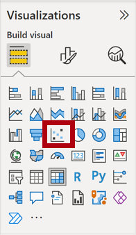
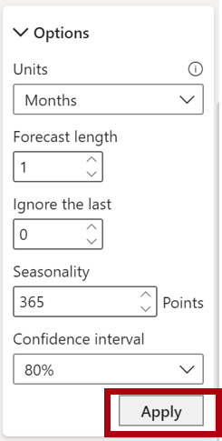

---
lab:
    title: 'Perform Advanced Analytics in Power BI'
    module: 'Perform Data Analysis in Power BI'
---

# **Perform Data Analysis in Power BI**

## **Lab story**

In this lab, you'll create the **Sales Exploration** report.

In this lab you learn how to:

- Create animated scatter charts
- Use a visual to forecast values

Trong phòng thí nghiệm này, bạn sẽ tạo báo cáo **Khám phá doanh số**.

Trong phòng thí nghiệm này, bạn học cách:

- Tạo biểu đồ phân tán hoạt hình
- Sử dụng trực quan để dự đoán giá trị

**This lab should take approximately 30 minutes.**

## **Get started – Sign in**

In this task, you'll set up the environment for the lab by signing in to Power BI.

*Note: If you've already signed in to Power BI, skip to the next task.*

Trong nhiệm vụ này, bạn sẽ thiết lập môi trường cho phòng thí nghiệm bằng cách đăng nhập vào Power BI.

*Lưu ý: Nếu bạn đã đăng nhập vào Power BI, hãy chuyển sang tác vụ tiếp theo.*

1. To open Microsoft Edge, on the taskbar, select the Microsoft Edge program shortcut.
Để mở Microsoft Edge, trên thanh tác vụ, hãy chọn phím tắt chương trình Microsoft Edge.

     

1. In the Microsoft Edge browser window, navigate to **https://app.powerbi.com**.

    *Tip: You can also use the Power BI Service favorite on the Microsoft Edge favorites bar.*

1. Complete the sign-in process with your organizational (or provided) credentials. If prompted by Microsoft Edge to stay signed in, select **Yes**.

1. In the Microsoft Edge browser window, in the Power BI service, in the **Navigation** pane, expand **My Workspace**. Leave the Microsoft Edge browser window open.

     

## **Get started – Create a dataset**

In this task, you'll set up the environment for the lab by creating a dataset. *If you've already published the dataset, please move to the next task.*

Trong nhiệm vụ này, bạn sẽ thiết lập môi trường cho phòng thí nghiệm bằng cách tạo tập dữ liệu. *Nếu bạn đã xuất bản tập dữ liệu, vui lòng chuyển sang nhiệm vụ tiếp theo.*

1. In the Microsoft Edge browser window, in the Power BI service, navigate to **My Workspace**.

1. Select **Upload > Browse**.

1. Navigate to **D:\PL300\Labs\08-perform-data-analysis-in-power-bi-desktop\Starter** folder.

1. Select the **Sales Analysis.pbix** file, and then select **Open**.

	*If prompted to replace the dataset, select **Replace it**.*

*This method will create a report and a dataset. We will only use the dataset to create a new report in this exercise. This same process could be done with an existing dataset from a different report instead of uploading new. Also, if you aren't using the report, workspace best practices suggest you delete the unnecessary file.*

## **Create the report**

In this task, you'll create a live connection to the Power BI dataset created in the last task, and then create a new **Sales Exploration** report.

Trong tác vụ này, bạn sẽ tạo một kết nối trực tiếp tới tập dữ liệu Power BI được tạo trong tác vụ trước, sau đó tạo báo cáo **Sales Exploration** mới.

1. Open Power BI Desktop.
1. Mở Power BI Desktop.

    

    *Important: If you already have Power BI Desktop open (from a previous lab), close that instance.*

    *Tip: By default, the Getting Started dialog box opens in front of Power BI Desktop. You can choose to sign-in, and then close the pop-up.*

	*Quan trọng: Nếu bạn đã mở Power BI Desktop (từ phòng thí nghiệm trước đó), hãy đóng phiên bản đó.*

	*Mẹo: Theo mặc định, hộp thoại Bắt đầu sẽ mở ra trước Power BI Desktop. Bạn có thể chọn đăng nhập rồi đóng cửa sổ bật lên.*

1. In the Home ribbon, select **Get Data > Power BI datasets**.
Trong dải băng Trang chủ, chọn **Get Data > Power BI datasets**.

1. In the **Data hub** window, select the **Sales Analysis** dataset in **My Workspace**, and then **Connect** or double-click to load the dataset.

1. Navigate to **File > Save** and save the file name as **Sales Exploration** in the **D:\PL300\MySolution** folder.

*You’ll now create two report pages, and on each page you’ll work with a different visual to analyze and explore data.*

## **Create an animated scatter chart**

In this task, you'll create a scatter chart that can be animated.
Trong nhiệm vụ này, bạn sẽ tạo một biểu đồ tán xạ có thể hoạt hình.

1. Rename **Page 1** as **Scatter Chart**.
Đổi tên **Page 1** thành **Scatter Chart**.

1. Add a **Scatter Chart** visual to the report page, and then position and resize it so it fills the entire page.
1. Thêm hình ảnh **Scatter Chart** vào trang báo cáo, sau đó định vị và thay đổi kích thước để nó lấp đầy toàn bộ trang.
    
	*The chart can be animated when a field is added to the **Play Axis** well/area.*
	*Biểu đồ có thể hoạt hình khi một trường được thêm vào giếng/khu vực **Play Axis**.*

	 

	 

1. Add the following fields to the visual wells/areas:
1. (Thêm các trường sau vào giếng/khu vực trực quan:)
    
	*The labs use a shorthand notation to reference a field. It will look like this: **Reseller** **\|** **Business Type**. In this example, **Reseller** is the table name and **Business Type** is the field name.*

	* Các phòng thí nghiệm sử dụng ký hiệu tốc ký để tham chiếu một trường. Nó sẽ giống như sau: **Reseller** **\|** **Business Type**. Trong ví dụ này, **Reseller** là tên bảng và **Business Type** là tên trường.*

	 - X Axis: **Sales \| Sales**
	 - Y Axis: **Sales \| Profit Margin**
	 - Legend: **Reseller \| Business Type**
	 - Size: **Sales \| Quantity**
	 - Play Axis: **Date \| Quarter**

1. In the **Filters** pane, add the **Product \| Category** field to the **Filters On This Page** well/area.
1. Trong ngăn **Filters**, thêm **Product \| Category** vào giếng/khu vực **Filters On This Page**.

1. In the filter card, filter by **Bikes**.
Trong thẻ bộ lọc, hãy lọc theo **Bikes**.

1. To animate the chart, at the bottom left corner, select **Play**.
Để tạo hiệu ứng động cho biểu đồ, ở góc dưới cùng bên trái, hãy chọn **Play**.

	

1. Watch the entire animation cycle from **FY2018 Q1** to **FY2020 Q4**.
Xem toàn bộ chu kỳ hoạt hình từ **FY2018 Q1** đến **FY2020 Q4**.
    
	*The scatter chart allows understanding the measure values simultaneously: in this case, order quantity, sales revenue, and profit margin.*
    
	*Each bubble represents a reseller business type. Changes in the bubble size reflect increased or decreased order quantities. While horizontal movements represent increases/decreases in sales revenue, and vertical movements represent increases/decreases in profitability.*

	*Biểu đồ phân tán cho phép hiểu đồng thời các giá trị đo lường: trong trường hợp này là số lượng đặt hàng, doanh thu bán hàng và tỷ suất lợi nhuận.*
    
	*Mỗi bong bóng đại diện cho một loại hình kinh doanh của người bán lại. Những thay đổi về kích thước bong bóng phản ánh số lượng đặt hàng tăng hoặc giảm. Trong khi chuyển động theo chiều ngang biểu thị mức tăng/giảm doanh thu bán hàng và chuyển động theo chiều dọc biểu thị mức tăng/giảm lợi nhuận.*

1. When the animation stops, select one of the bubbles to reveal its tracking over time.
Khi hoạt ảnh dừng lại, hãy chọn một trong các bong bóng để hiển thị theo dõi của nó theo thời gian.

1. Hover the cursor over any bubble to reveal a tooltip describing the measure values for the reseller type at that point in time.
Di con trỏ qua bất kỳ bong bóng nào để hiển thị chú giải công cụ mô tả các giá trị đo lường cho loại người bán lại tại thời điểm đó.

1. In the **Filters** pane, filter by **Clothing** only, and notice that it produces a very different result.
Trong ngăn **Filters**, chỉ lọc theo **Clothing** và lưu ý rằng nó tạo ra một kết quả rất khác.

1. Save the Power BI Desktop file.

## **Create a forecast**

In this task, you'll create a forecast to determine possible future sales revenue.
Trong nhiệm vụ này, bạn sẽ tạo dự báo để xác định doanh thu bán hàng có thể có trong tương lai.

1. Add a new page, and then rename the page to **Forecast**.
Thêm một trang mới rồi đổi tên trang thành **Forecast**.

1. Add a **Line Chart** visual to the report page, and then position and resize it so it fills the entire page.
Thêm hình ảnh **Line Chart** vào trang báo cáo, sau đó định vị và thay đổi kích thước để nó lấp đầy toàn bộ trang.

	 

	 

1. Add the following fields to the visual wells/areas:
Thêm các trường sau vào giếng/khu vực trực quan:

	 - X-axis: **Date \| Date**
	 - Y-axis: **Sales \| Sales**

1. In the **Filters** pane, add the **Date \| Year** field to the **Filters On This Page** well/area.
Trong ngăn **Filters**, thêm **Date \| Year** vào giếng/khu vực **Filters On This Page**.

1. In the filter card, filter by two years: **FY2019** and **FY2020**.
Trong thẻ bộ lọc, hãy lọc theo hai năm: **FY2019** và **FY2020**.
	
	*When forecasting over a time line, you'll need at least two cycles (years) of data to produce an accurate and stable forecast.*
	*Khi dự báo theo dòng thời gian, bạn sẽ cần ít nhất hai chu kỳ (năm) dữ liệu để đưa ra dự báo chính xác và ổn định.*

1. Add also the **Product \| Category** field to the **Filters On This Page** well/area, and filter by **Bikes**.
Thêm cả **Product \| Category** vào giếng/khu vực **Filters On This Page** và lọc theo **Bikes**.

1. To add a forecast, beneath the **Visualizations** pane, select the **Analytics** pane.
Để thêm dự báo, bên dưới ngăn **Visualizations**, hãy chọn ngăn **Analytics**

	 

8. Expand the **Forecast** section.
Mở rộng phần **Forecast**.
    
	*If the **Forecast** section isn't available, it’s probably because the visual hasn’t been correctly configured. Forecasting is only available when two conditions are met: the axis has a single field of type date, and there’s only one value field.*

	*Nếu phần **Forecast** không khả dụng, thì có thể là do hình ảnh chưa được định cấu hình chính xác. Tính năng dự báo chỉ khả dụng khi đáp ứng hai điều kiện: trục có một trường loại ngày và chỉ có một trường giá trị.*

1. Turn the **Forecast** option to **On**.

1. Configure the following forecast properties, then **Apply**:
Định cấu hình các thuộc tính dự báo sau, sau đó **Apply**:

	- Units: **Months**
	- Forecast length: **1 month**
	- Seasonality: **365**
	- Confidence interval: **80%**

	- Đơn vị: **Tháng**
	- Thời lượng dự báo: **1 tháng**
	- Thời vụ: **365**
	- Khoảng tin cậy: **80%**

	

1. In the line visual, notice that the forecast has extended one month beyond the history data.
Trong dòng trực quan, lưu ý rằng dự báo đã kéo dài một tháng ngoài dữ liệu lịch sử.
    
	*The gray area represents the confidence. The wider the confidence, the less stable—and therefore the less accurate—the forecast is likely to be.*
    
	*When you know the length of the cycle, in this case annual, you should enter the seasonality points. Sometimes it could be weekly (7), or monthly (30).*
	
	*Khu vực màu xám thể hiện sự tự tin. Độ tin cậy càng rộng thì dự báo càng kém ổn định—và do đó càng kém chính xác—có khả năng xảy ra.*
    
	*Khi bạn biết độ dài của chu kỳ, trong trường hợp này là hàng năm, bạn nên nhập các điểm thời vụ. Đôi khi có thể là hàng tuần (7) hoặc hàng tháng (30).*

1. In the **Filters** pane, filter by **Clothing** only, and notice that it produces a different result.
Trong ngăn **Filters**, chỉ lọc theo **Clothing** và lưu ý rằng nó tạo ra một kết quả khác.

### **Finish up**

In this task, you'll complete the lab in Power BI Desktop.

1. Select the **Scatter Chart** page.

1. Save the Power BI Desktop file.

1. To publish the file to your **My workspace**, on the **Home** ribbon tab, from inside the **Share** group, select **Publish** and then select **Select** to publish.

	

1. Close Power BI Desktop.
