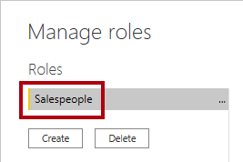
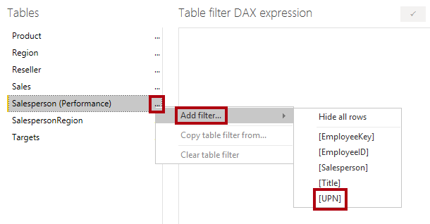

---
lab:
    title: 'Enforce Row-Level Security'
    module: 'Enforce Row-Level Security'
---

# **Enforce Row-Level Security**

## **Lab story**

In this lab, you'll enforce row-level security to ensure that a salesperson can only analyze sales data for their assigned region(s).

In this lab you learn how to:

- Enforce row-level security
- Choose between dynamic and static methods

Trong phòng thí nghiệm này, bạn sẽ thực thi bảo mật cấp hàng để đảm bảo rằng nhân viên bán hàng chỉ có thể phân tích dữ liệu bán hàng cho (các) khu vực được chỉ định của họ.

Trong phòng thí nghiệm này, bạn học cách:

- Thực thi bảo mật cấp hàng
- Chọn giữa các phương thức động và tĩnh

**This lab should take approximately 45 minutes.**

## **Get started**

In this task, you'll set up the environment for the lab.

*Important: If you're continuing on from the previous lab (and you completed that lab successfully), don't complete this task; instead, continue from the next task.*

Trong nhiệm vụ này, bạn sẽ thiết lập môi trường cho phòng thí nghiệm.

*Quan trọng: Nếu bạn đang tiếp tục từ phòng thí nghiệm trước (và bạn đã hoàn thành bài thí nghiệm đó thành công), thì đừng hoàn thành nhiệm vụ này; thay vào đó, hãy tiếp tục từ nhiệm vụ tiếp theo.*

1. Open Power BI Desktop.

    

    *Tip: By default, the Getting Started dialog box opens in front of Power BI Desktop. **Sign-in** and then close the pop-up.*

1. To open the starter Power BI Desktop file, select the **File > Open Report > Browse Reports**.

1. In the **Open** window, navigate to the **D:\PL300\Labs\10-row-level-security\Starter** folder, and open the **Sales Analysis** file.

1. Close any informational windows that may open.

1. Notice the yellow warning message beneath the ribbon. *This message alerts you to the fact that the queries haven't been applied to load as model tables. You’ll apply the queries later in this lab.*
    
	*To dismiss the warning message, at the right of the yellow warning message, select **X**.*

1. To create a copy of the file, go to **File > Save As** and save to **D:\PL300\MySolution** folder.

1. If prompted to apply changes, select **Apply Later**.

## **Enforce row-level security**

In this task, you'll enforce row-level security to ensure a salesperson can only see sales made in their assigned region(s).
Trong tác vụ này, bạn sẽ thực thi bảo mật cấp hàng để đảm bảo nhân viên bán hàng chỉ có thể xem doanh số bán hàng được thực hiện trong (các) khu vực được chỉ định của họ.

1. Switch to Data view.
Chuyển sang chế độ xem Dữ liệu.

   

1. In the **Data** pane, select the **Salesperson (Performance)** table.
Trong ngăn **Data**, hãy chọn bảng **Salesperson (Performance)**.

1. Review the data, noticing that Michael Blythe (EmployeeKey 281) has a UPN value of: **michael-blythe@adventureworks.com**
Xem lại dữ liệu, nhận thấy rằng Michael Blythe (EmployeeKey 281) có giá trị UPN là: **michael-blythe@adventureworks.com**
    
	*You may recall that Michael Blythe is assigned to three sales regions: US Northeast, US Central, and US Southeast.*
   *Bạn có thể nhớ rằng Michael Blythe được chỉ định phụ trách ba khu vực bán hàng: Đông Bắc Hoa Kỳ, Trung tâm Hoa Kỳ và Đông Nam Hoa Kỳ.*

1. On the **Modeling** ribbon tab, from inside the **Security** group, select **Manage Roles**.
Trên tab dải băng **Modeling**, từ bên trong nhóm **Security**, hãy chọn **Manage Roles**.

    

1. In the **Manage Roles** window, select **Create**.
Trong cửa sổ **Manage Roles**, hãy chọn **Create**.

1. In the box, replace the selected text with the name of the role: **Salespeople**, and then press **Enter**.
Trong hộp, hãy thay thế văn bản đã chọn bằng tên của vai trò: **Salespeople**, sau đó nhấn **Enter**.

   

1. To assign a filter, for the **Salesperson (Performance)** table, select the ellipsis (…) character, and then select **Add Filter \| [UPN]**.
Để chỉ định bộ lọc, đối với bảng **Salesperson (Performance)**, hãy chọn ký tự dấu chấm lửng (…), sau đó chọn **Add Filter \| [UPN]**.

   

1. In the **Table Filter DAX Expression** box, modify the expression by replacing **“Value”** with **USERPRINCIPALNAME()**, and then **Save**.
Trong hộp **Table Filter DAX Expression**, hãy sửa đổi biểu thức bằng cách thay thế **““Value””** bằng **USERPRINCIPALNAME()**, sau đó **Save**.
    
	*USERPRINCIPALNAME() is a Data Analysis Expressions (DAX) function that returns the name of the authenticated user. It means that the **Salesperson (Performance)** table will filter by the User Principal Name (UPN) of the user querying the model.*

   *USERPRINCIPALNAME() là một hàm Biểu thức Phân tích Dữ liệu (DAX) trả về tên của người dùng được xác thực. Điều đó có nghĩa là bảng **Salesperson (Performance)** sẽ lọc theo Tên chính của người dùng (UPN) của người dùng đang truy vấn mô hình.*

   

1. To test the security role, on the **Modeling** ribbon tab, from inside the **Security** group, select **View As**.
Để kiểm tra vai trò bảo mật, trên tab ribbon **Modeling**, từ bên trong nhóm **Security**, hãy chọn **View As**.

   

1. In the **View as Roles** window, check the **Other User** item, and then in the corresponding box, enter: **michael-blythe@adventureworks.com**
Trong cửa sổ **View as Roles**, hãy chọn mục **Other User**, rồi trong hộp tương ứng, nhập: **michael-blythe@adventureworks.com**

1. Check the **Salespeople** role, and then **OK**.
Kiểm tra vai trò **Salespeople** rồi **OK**.
    
	*This configuration results in using the **Salespeople** role and impersonating the user with your Michael Blythe’s name.*
   *Cấu hình này dẫn đến việc sử dụng vai trò **Nhân viên bán hàng** và mạo danh người dùng bằng tên Michael Blythe của bạn.*

   

1. Notice the yellow banner above the report page, describing the test security context.
Lưu ý biểu ngữ màu vàng phía trên trang báo cáo, mô tả bối cảnh bảo mật thử nghiệm.

   

1. In the table visual, notice that only the salesperson **Michael Blythe** is listed.
Trong hình ảnh bảng, lưu ý rằng chỉ có nhân viên bán hàng **Michael Blythe** được liệt kê.

   

1. To stop testing, at the right side of the yellow banner, select **Stop Viewing**.
Để dừng thử nghiệm, ở bên phải của biểu ngữ màu vàng, hãy chọn **Stop Viewing**.

   

1. To delete the **Salespeople** role, on the **Modeling** ribbon tab, from inside the **Security** group, select **Manage Roles**.
Để xóa vai trò **Salespeople**, trên tab dải băng **Modeling**, từ bên trong nhóm **Bảo mật**, hãy chọn **Manage Roles**.

   

1. In the **Manage Roles** window, select **Delete**. When prompted to confirm the deletion, select **Yes, Delete**.
Trong cửa sổ **Manage Roles**, hãy chọn **Delete**. Khi được nhắc xác nhận việc xóa, hãy chọn **Yes, Delete**.

   

### **Finish up**

In this task, you'll complete the lab.

1. Select **Save**, then save the Power BI Desktop file to end the lab.

*Note: When the Power BI Desktop file is published to the Power BI service, you’ll need to complete a post-publication task to map security principals to the **Salespeople** role. You won’t do that in this lab.*
